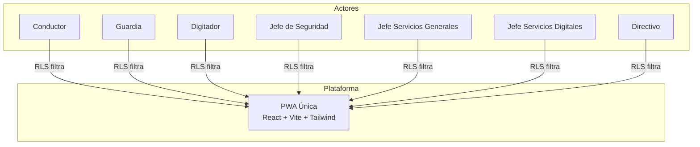
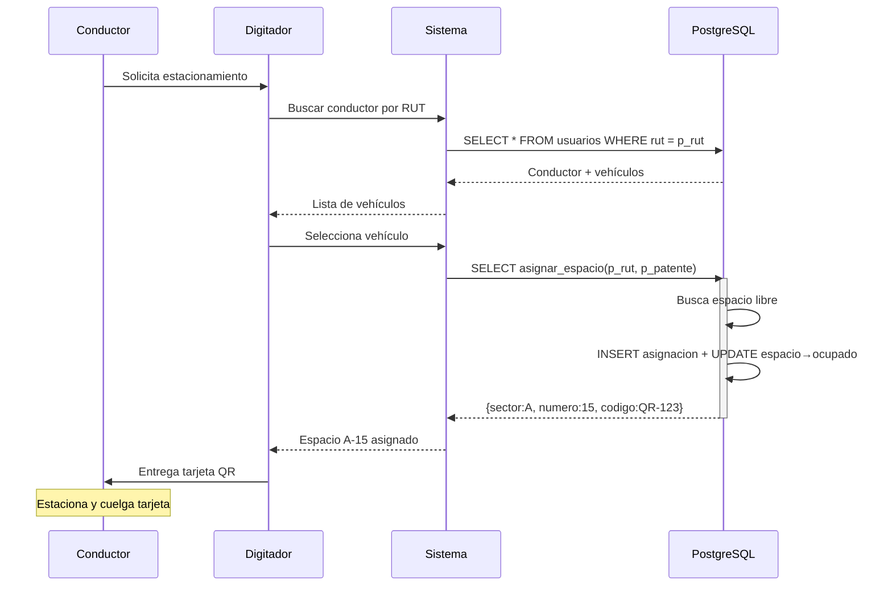
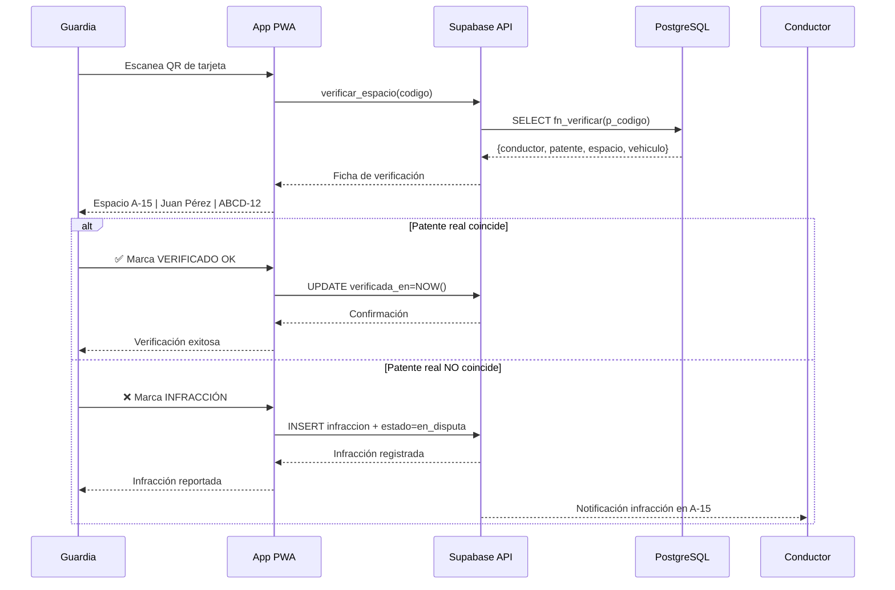
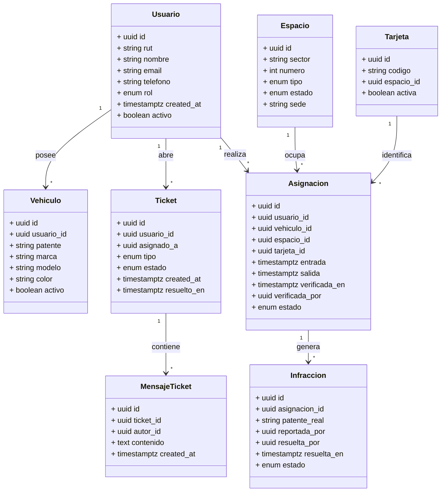
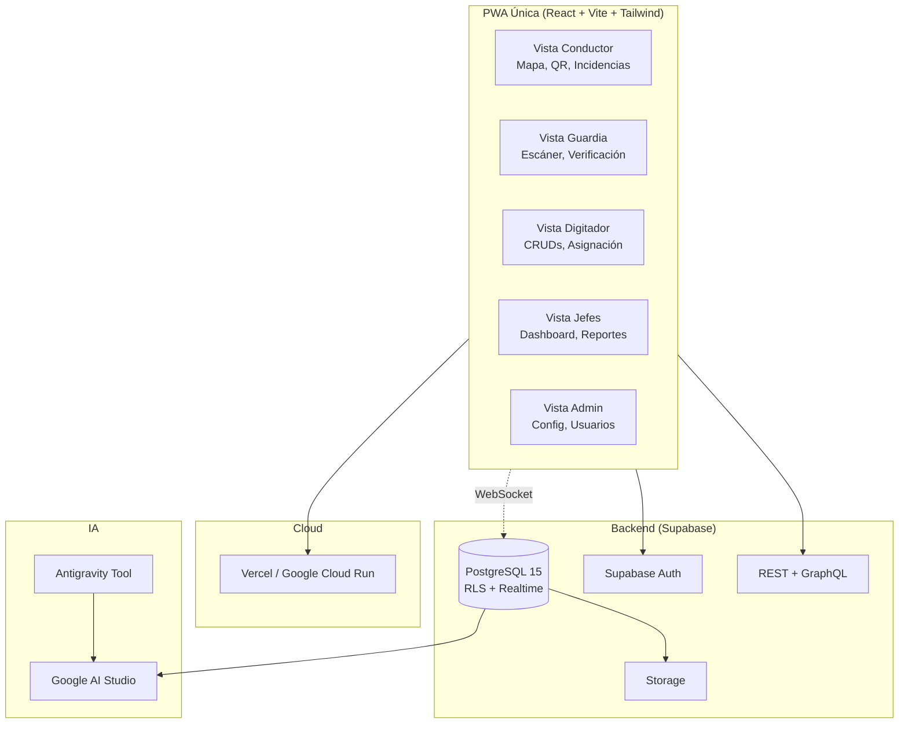
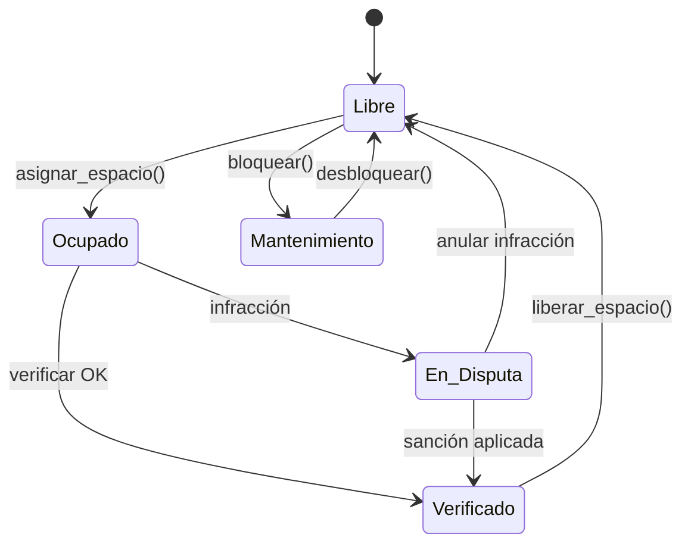
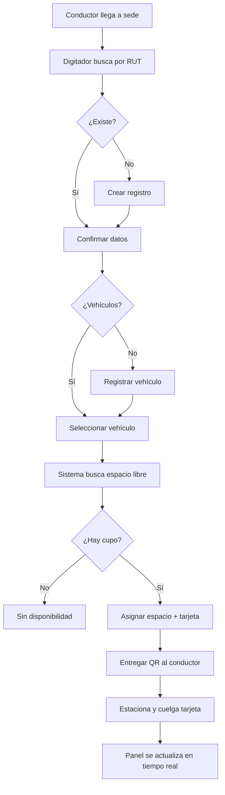

# Documentación Completa del Sistema
## Gestión Inteligente de Estacionamientos — Duoc UC Sede Maipú

**Proyecto**: Codec-Maipu  
**Versión**: 2.0  
**Fecha**: 2026-06-05  
**Bootcamp**: CODEC AI — Duoc UC  
**Stack**: React + Vite + TypeScript + Tailwind + shadcn + Supabase

---

## Índice
1. [Introducción y Contexto](#1-introducción-y-contexto)
2. [Stack Tecnológico y Decisiones Arquitectónicas](#2-stack-tecnológico-y-decisiones-arquitectónicas)
3. [Actores del Sistema](#3-actores-del-sistema)
4. [Perfiles de Cuenta](#4-perfiles-de-cuenta)
5. [Casos de Uso](#5-casos-de-uso)
6. [Historias de Usuario](#6-historias-de-usuario)
7. [Vistas por Rol](#7-vistas-por-rol)
8. [Diagramas del Sistema](#8-diagramas-del-sistema)
9. [Modelo de Datos](#9-modelo-de-datos)
10. [Flujos de Operación](#10-flujos-de-operación)
11. [Estrategias Técnicas](#11-estrategias-técnicas)
12. [Dashboard y Analítica](#12-dashboard-y-analítica)
13. [Guía de Desarrollo Local](#13-guía-de-desarrollo-local)
14. [Theme Duoc UC](#14-theme-duoc-uc)
15. [Requisitos Adicionales](#15-requisitos-adicionales)
16. [Requisitos No Funcionales](#16-requisitos-no-funcionales)
17. [Reglas de Negocio](#17-reglas-de-negocio)
18. [Planificación Ágil](#18-planificación-ágil)
19. [Glosario](#19-glosario)
20. [Skill de Herramientas](#20-skill-de-herramientas)
21. [Plan de Pruebas](#21-plan-de-pruebas)
22. [Evidencias - Tablero Ágil](#22-evidencias---tablero-ágil)

---

## 1. Introducción y Contexto

### 1.1 Nombre del Proyecto
**Codec-Maipu** — Sistema de Gestión Inteligente de Estacionamientos Duoc UC Sede Maipú.

### 1.2 Propósito
Sistema digital que gestiona la asignación, verificación y análisis del uso de estacionamientos en la sede Duoc UC Maipú, reemplazando el control manual por un sistema híbrido físico+digital con tarjetas identificadoras QR.

### 1.3 Contexto del Negocio
Duoc UC Sede Maipú es el campus más extenso y poblado de Duoc UC en Santiago/Chile, con más de **11.000 estudiantes**, cientos de docentes y personal administrativo distribuidos en **33 carreras**. Cuenta con **110 espacios de estacionamiento** cuyo control actual se limita a una barrera automatizada con sensor de chip que solo valida acceso sin generar datos útiles para la gestión.

**Problemas actuales:**
- La guardia no tiene panel visual en tiempo real de ocupación
- No existe trazabilidad conductor-vehículo-ubicación
- El jefe de guardia no gestiona reservas ni bloqueos
- El conductor no conoce la disponibilidad antes de llegar
- No hay canal de comunicación conductor-guardia
- No hay análisis de tendencias de ocupación
- La dirección carece de datos para la toma de decisiones

### 1.4 Alcance del Sistema
- Registro y administración de conductores y vehículos (enrolamiento)
- Asignación y liberación de espacios de estacionamiento
- Verificación en terreno mediante escaneo QR de tarjeta física
- Mapa SVG interactivo con espacios numerados y colores por estado
- Gestión de infracciones con notificaciones automáticas
- Canal de comunicación tipo ticket entre conductor y guardia
- Dashboard de ocupación en tiempo real vía WebSocket
- Reportes analíticos con métricas de rotación (hora/día/mes/año)
- Alertas de capacidad crítica y expansión
- PWA única instalable con soporte offline parcial (solo lectura)

### 1.5 Formato del Bootcamp
- **Programa**: Bootcamp CODEC AI — Duoc UC Sede Maipú
- **Formato**: Competencia intersedes, top 3 premiados
- **Metodología**: Scrum Guide 2020, evaluación por 5 checkpoints
- **Criterios evaluación**: Análisis de negocio, modelado UML, desarrollo ágil, diseño sistemas, pitch final

---

## 2. Stack Tecnológico y Decisiones Arquitectónicas

### 2.1 Stack Definitivo

| Capa | Tecnología | Versión | Costo |
|------|-----------|---------|-------|
| Frontend | React + Vite + Tailwind + shadcn | React 18+ | $0 |
| Backend/DB | Supabase (PostgreSQL 15, Auth, Realtime, Storage) | Free Tier | $0 |
| IA | Google AI Studio + Antigravity Tool | Free Tier | $0 |
| Hosting PWA | Vercel / Google Cloud Run | Hobby/Free | $0 |
| CI/CD | GitHub Actions | Free | $0 |
| Dev DB | Supabase CLI + Docker (local) | - | $0 |

**Costo total mensual**: $0 (Free Tier) | $45/mes con upgrades (Supabase Pro + Vercel Pro)

### 2.2 Decisiones Arquitectónicas (ADR)

#### ADR-001: Supabase como BaaS central
- **Motivo**: PostgreSQL real con RLS, Realtime nativo vía WAL, migrations con CLI
- **Descartado**: Firebase (NoSQL), AWS (complejidad IaaS)

#### ADR-002: PWA única para todos los roles
- **Motivo**: Un solo codebase reduce mantención, testing y deploy
- **Control por RLS**: cada rol ve diferentes componentes según `usuarios.rol`
- **Descartado**: Tauri, Ionic, apps nativas
- **Framework**: Vite > Next.js (sin SSR, sin SEO, más rápido)

#### ADR-003: Vistas materializadas para analytics
- **Motivo**: Consultas agregadas sobre 110 espacios + miles de asignaciones necesitan precomputarse
- **Solución**: `mv_ocupacion_actual`, `mv_flujo_diario` refrescadas por triggers

#### ADR-004: RLS como única barrera de seguridad
- **No hay backend intermedio**: frontend consulta Supabase directo
- Cada tabla tiene policies RLS por rol, auditables en SQL

#### ADR-005: QR de un solo uso
- Cada tarjeta tiene UUID único. Al usar: `UPDATE tarjetas SET activa = false`
- Segundo escaneo: rechazado por `validar_qr()` atómico

#### ADR-006: Offline read-only
- Service worker con `NetworkFirst` para datos, `CacheFirst` para assets
- Mutaciones bloqueadas si `navigator.onLine === false`

### 2.3 Presupuesto Cloud

| Servicio | Free | Pro |
|----------|------|-----|
| Supabase | 500MB DB, 50k usuarios, 2GB ancho de banda | $25/mes |
| Vercel | 100GB ancho de banda, 6000 builds/mes | $20/mes |
| Google Cloud Run | Pay-per-use (alternativa Vercel) | Variable |
| **Total** | **$0/mes** | **$45/mes** |

Tope máximo: **$50 USD/mes** según rúbrica del bootcamp.

---

## 3. Actores del Sistema

### 3.1 Mapeo de Actores



| # | Actor | Descripción | Plataforma | Prioridad |
|---|-------|-------------|------------|-----------|
| ACT-01 | **Conductor** | Usuario final que estaciona su vehículo. Consulta disponibilidad, registra ingreso, reporta incidencias | PWA | Alta |
| ACT-02 | **Guardia** | Personal de seguridad que verifica espacios y tarjetas en terreno. Escanea QR, coteja datos, reporta infracciones | PWA | Alta |
| ACT-03 | **Digitador** | Personal administrativo que registra conductores, vehículos, asigna espacios y tarjetas físicas | PWA | Alta |
| ACT-04 | **Jefe de Seguridad** | Supervisa ocupación en vivo, audita verificaciones, resuelve infracciones | PWA | Media |
| ACT-05 | **Jefe Servicios Generales** | Administra la sede: configura sectores, gestiona tarjetas, genera reportes | PWA | Media |
| ACT-06 | **Jefe Servicios Digitales** | Supervisa plataforma digital, integraciones, APIs, datos técnicos | PWA | Baja |
| ACT-07 | **Directivo** | Visión global: KPIs, tendencias, alertas de capacidad, proyecciones | PWA | Baja |

### 3.2 Matriz de Permisos por Rol (RBAC)

| Recurso | Conductor | Guardia | Digitador | Jefe Seg. | Jefe SG | Jefe SD | Directivo |
|---------|-----------|---------|-----------|-----------|---------|---------|-----------|
| Propio perfil | CRUD | - | CRUD | - | - | - | - |
| Propios vehículos | CRUD | - | CRUD | - | - | - | - |
| Espacios | LEER | LEER | CRUD | LEER | CRUD | LEER | LEER |
| Tarjetas físicas | - | LEER | CRUD | LEER | CRUD | CRUD | - |
| Asignaciones | LEER+propias | LEER+VERIFICAR | CRUD | LEER | LEER | LEER | LEER |
| Infracciones | LEER+propias | CREAR | - | CRUD | LEER | LEER | LEER |
| Dashboard en vivo | - | LEER | - | LEER | LEER | LEER | LEER |
| Reportes analíticos | - | - | - | LEER | LEER | LEER | LEER |
| Configuración sede | - | - | - | - | CRUD | - | - |
| Usuarios del sistema | - | - | CRUD | LEER | LEER | LEER | LEER |
| Tickets incidencias | CREAR+LEER | LEER+RESPONDER | - | - | - | - | - |

---

## 4. Perfiles de Cuenta

| Perfil | Tipo de Cuenta | Autenticación | Acceso |
|--------|---------------|---------------|--------|
| Conductor | Autoregistro o creado por Digitador | RUT + verificación | PWA |
| Guardia | Creado por Jefe SG | Email + password | PWA |
| Digitador | Creado por Jefe SG | Email + password | PWA |
| Jefe Seguridad | Creado por Jefe SG | Email + password | PWA |
| Jefe Servicios Grales | Super admin | Email + password | PWA |
| Jefe Servicios Digitales | Creado por Jefe SG | Email + password | PWA |
| Directivo | Creado por Jefe SG | Email + password | PWA |

---

## 5. Casos de Uso

### 5.1 Diagrama General

```mermaid
graph TB
    subgraph CU["Casos de Uso"]
        UC01[UC-01: Registrarse como Conductor]
        UC02[UC-02: Gestionar Vehículos]
        UC03[UC-03: Asignar Espacio]
        UC04[UC-04: Verificar Espacio]
        UC05[UC-05: Liberar Espacio]
        UC06[UC-06: Reportar Infracción]
        UC07[UC-07: Resolver Infracción]
        UC08[UC-08: Consultar Ocupación en Vivo]
        UC09[UC-09: Gestionar Espacios]
        UC10[UC-10: Gestionar Tarjetas]
        UC11[UC-11: Generar Reportes]
        UC12[UC-12: Configurar Sede]
        UC13[UC-13: Gestionar Usuarios]
        UC14[UC-14: Enrolar Conductor]
        UC15[UC-15: Reportar Incidencia]
        UC16[UC-16: Ver Dashboard Global]
        UC17[UC-17: Abrir Ticket Comunicación]
        UC18[UC-18: Responder Ticket]
    end
    subgraph ACT["Actores"]
        COND[Conductor]
        GUAR[Guardia]
        DIG[Digitador]
        JSEG[Jefe Seguridad]
        JSG[Jefe Servicios Grales]
        DIR[Directivo]
    end
    COND --> UC01 & UC02 & UC15 & UC17
    GUAR --> UC04 & UC05 & UC06 & UC08 & UC18
    DIG --> UC03 & UC05 & UC09 & UC10 & UC14
    JSEG --> UC07 & UC08 & UC11
    JSG --> UC09 & UC10 & UC11 & UC12 & UC13
    DIR --> UC16 & UC11
```



### 5.2 Especificación de Casos de Uso

#### UC-01: Registrarse como Conductor
| Elemento | Descripción |
|----------|-------------|
| **Actor** | Conductor, Digitador |
| **Precondición** | Conductor no registrado |
| **Postcondición** | Conductor + vehículo(s) registrados |
| **Flujo** | 1. Conductor da RUT al Digitador<br>2. Digitador busca en sistema<br>3. Si no existe: crea registro (RUT, nombre, email, teléfono)<br>4. Registra vehículo(s): patente, marca, modelo, color<br>5. Queda habilitado |

#### UC-02: Gestionar Vehículos
| Elemento | Descripción |
|----------|-------------|
| **Actor** | Conductor, Digitador |
| **Flujo** | CRUD de vehículos + selección de vehículo activo |

#### UC-03: Asignar Espacio
| Elemento | Descripción |
|----------|-------------|
| **Actor** | Digitador |
| **Precondición** | Conductor registrado, espacios disponibles |
| **Postcondición** | Espacio ocupado, asignación creada, tarjeta entregada |
| **Flujo** | 1. Digitador selecciona conductor por RUT<br>2. Selecciona vehículo del día<br>3. Sistema asigna espacio libre + tarjeta QR<br>4. Entrega tarjeta física al conductor<br>5. Conductor estaciona |
| **Alterno** | Sin espacios libres: informar al conductor |



#### UC-04: Verificar Espacio
| Elemento | Descripción |
|----------|-------------|
| **Actor** | Guardia |
| **Precondición** | Espacio ocupado con tarjeta QR visible |
| **Postcondición** | Asignación verificada o infracción reportada |
| **Flujo** | 1. Guardia escanea QR de tarjeta colgada<br>2. Sistema muestra: espacio, conductor, patente esperada, vehículo<br>3a. Si patente coincide → VERIFICADO OK<br>3b. Si no coincide → INFRACCIÓN + notificación al conductor |



#### UC-05: Liberar Espacio
| Actor | Guardia, Digitador |
|-------|-------------------|
| **Flujo** | Conductor devuelve tarjeta → Guardia/Digitador registra devolución → Sistema libera espacio |

#### UC-06: Reportar Infracción
| Actor | Guardia |
|-------|---------|
| **Flujo** | Ver UC-04 paso 3b |

#### UC-07: Resolver Infracción
| Actor | Jefe Seguridad |
|-------|---------------|
| **Flujo** | 1. Revisa infracciones pendientes<br>2. Decide: anular o sancionar<br>3. Sistema notifica al conductor |

#### UC-08: Consultar Ocupación en Vivo
| Actor | Guardia, Jefe Seguridad, Jefe SG |
|-------|--------------------------------|
| **Flujo** | Accede al panel con grilla SVG de espacios coloreados + WebSocket Realtime |

#### UC-09: Gestionar Espacios
| Actor | Digitador, Jefe SG |
|-------|-------------------|
| **Flujo** | CRUD de sectores, números, tipos. Cambio de estado a mantenimiento |

#### UC-10: Gestionar Tarjetas
| Actor | Digitador, Jefe SG |
|-------|-------------------|
| **Flujo** | Alta/baja de tarjetas físicas, asignación a espacio |

#### UC-11: Generar Reportes
| Actor | Jefe Seguridad, Jefe SG, Directivo |
|-------|----------------------------------|
| **Flujo** | Selecciona tipo de reporte + rango fechas → sistema consulta vistas materializadas |

#### UC-12: Configurar Sede
| Actor | Jefe Servicios Generales |
|-------|-------------------------|
| **Flujo** | Definir sectores, espacios por sector, reglas de asignación |

#### UC-13: Gestionar Usuarios del Sistema
| Actor | Digitador, Jefe SG |
|-------|-------------------|
| **Flujo** | CRUD de usuarios con roles del sistema |

#### UC-14: Enrolar Conductor
| Actor | Digitador |
|-------|----------|
| **Flujo** | Ver UC-01 |

#### UC-15: Reportar Incidencia (Conductor)
| Actor | Conductor |
|-------|-----------|
| **Flujo** | Abre canal de incidencias → escribe mensaje → guardia recibe notificación en tiempo real |

#### UC-16: Ver Dashboard Global
| Actor | Directivo |
|-------|-----------|
| **Flujo** | KPIs: ocupación %, ingresos hoy, tendencia 30d. Alerta si >85% por 7d |

#### UC-17: Abrir Ticket de Comunicación
| Actor | Conductor |
|-------|-----------|
| **Flujo** | 1. Conductor abre nuevo ticket desde la PWA<br>2. Selecciona tipo: problema, consulta, reporte<br>3. Escribe mensaje<br>4. Ticket queda en bandeja del guardia con estado `abierto` |

#### UC-18: Responder Ticket
| Actor | Guardia |
|-------|---------|
| **Flujo** | 1. Guardia ve tickets en bandeja<br>2. Responde con mensaje<br>3. Conductor recibe notificación<br>4. Ticket pasa a `en_curso` → `resuelto` al cerrar |

---

## 6. Historias de Usuario

| ID | Épica | Historia | Criterios (Gherkin) |
|----|-------|----------|---------------------|
| HU-01 | Enrolamiento | **Como** Digitador, **quiero** registrar un conductor con sus datos y vehículos **para** que pueda acceder al beneficio | **Dado** un conductor nuevo, **Cuando** ingreso su RUT y datos, **Entonces** el sistema crea el registro y habilita la asignación |
| HU-02 | Asignación | **Como** Digitador, **quiero** asignar un espacio libre a un conductor **para** que estacione en un lugar específico | **Dado** un conductor registrado, **Cuando** selecciono conductor y vehículo, **Entonces** el sistema asigna el primer espacio libre y entrega datos de tarjeta |
| HU-03 | Verificación | **Como** Guardia, **quiero** escanear el QR **para** verificar que el vehículo corresponde al asignado | **Dado** un QR escaneado, **Cuando** el sistema muestra los datos, **Entonces** puedo cotejar visualmente patente real vs esperada |
| HU-04 | Infracción | **Como** Guardia, **quiero** reportar discrepancia de patente **para** registrar infracción | **Dado** que la patente no coincide, **Cuando** marco infracción, **Entonces** el sistema notifica al conductor y marca espacio en disputa |
| HU-05 | Tiempo Real | **Como** Guardia, **quiero** ver ocupación actualizada en tiempo real **para** saber disponibilidad sin recorrer físicamente | **Dado** que ocurre un cambio, **Cuando** el WebSocket entrega el payload, **Entonces** la grilla se actualiza en <500ms |
| HU-06 | Liberación | **Como** Guardia, **quiero** registrar devolución de tarjeta **para** liberar el espacio | **Dado** un conductor que devuelve tarjeta, **Cuando** ingreso el código, **Entonces** se registra salida y espacio pasa a libre |
| HU-07 | Resolución | **Como** Jefe Seguridad, **quiero** revisar infracciones **para** determinar sanción o anulación | **Dado** una infracción pendiente, **Cuando** la resuelvo, **Entonces** se actualiza el estado y se notifica al conductor |
| HU-08 | Dashboard | **Como** Directivo, **quiero** ver KPIs y tendencias **para** tomar decisiones de capacidad | **Dado** que accedo al dashboard, **Cuando** se cargan los datos, **Entonces** veo ocupación %, ingresos, tendencia 30d y alertas |
| HU-09 | Incidencias | **Como** Conductor, **quiero** reportar un problema a la guardia **para** que me asistan | **Dado** un problema en estacionamiento, **Cuando** envío mensaje, **Entonces** la guardia recibe notificación en tiempo real |
| HU-10 | Configuración | **Como** Jefe SG, **quiero** configurar sectores y espacios **para** adaptar el sistema a la distribución física | **Dado** que modifico sectores, **Cuando** guardo cambios, **Entonces** se reflejan en asignaciones y mapa |
| HU-11 | Ticket | **Como** Conductor, **quiero** abrir un ticket de comunicación **para** recibir respuesta de la guardia | **Dado** que tengo una consulta, **Cuando** abro un ticket y escribo, **Entonces** el guardia lo recibe y puede responder |
| HU-12 | Mapa SVG | **Como** Guardia, **quiero** ver el mapa SVG del estacionamiento **para** identificar rápidamente espacios libres y ocupados | **Dado** el mapa renderizado, **Cuando** paso el mouse sobre un espacio, **Entonces** veo tooltip con datos del ocupante |
| HU-13 | Rotación | **Como** Jefe SG, **quiero** ver métricas de rotación **para** analizar uso por hora/día/mes/año | **Dado** el dashboard de métricas, **Cuando** selecciono un rango, **Entonces** veo estadía promedio, horas pico y ocupación |
| HU-14 | QR único | **Como** Guardia, **quiero** que cada QR sea válido una sola vez **para** evitar reuso fraudulento | **Dado** un QR ya escaneado, **Cuando** se intenta usar de nuevo, **Entonces** el sistema lo rechaza con mensaje "QR ya utilizado" |

---

## 7. Vistas por Rol

### 7.1 PWA Única — Vistas por Rol

#### Conductor

| Vista | Elementos | Lógica DB |
|-------|-----------|-----------|
| Login | Input RUT, botón "Ingresar" | Auth Supabase |
| Home | Mapa SVG con su espacio destacado (dorado), QR de tarjeta asignada, botón "Solicitar espacio" | `SELECT espacio_activo(rut)` |
| Mi Perfil | Nombre, RUT, email, teléfono | CRUD usuarios |
| Mis Vehículos | Lista de vehículos, botón agregar, selector activo | CRUD vehiculos |
| Tickets | Lista de tickets abiertos, botón "Nuevo Ticket", chat por ticket | `SELECT tickets WHERE usuario_id = auth.uid()` |
| Historial | Asignaciones pasadas con entrada/salida y patente | `SELECT historial(rut)` |
| Notificaciones | Alertas de infracciones, respuestas de tickets | Realtime + Push |

#### Guardia

| Vista | Elementos | Lógica DB |
|-------|-----------|-----------|
| Login | Email + password | Auth Supabase |
| Mapa SVG | Grilla de espacios coloreados con tooltips | `SELECT mv_ocupacion_actual` + Realtime |
| Escáner | Cámara con viewfinder QR, input manual alternativo | - |
| Ficha Verificación | Espacio, conductor, patente esperada, botones ✅ / ❌ | `SELECT verificar_espacio(codigo)` |
| Liberar | Input código tarjeta, confirmar | `SELECT liberar_espacio(codigo)` |
| Bandeja Tickets | Tickets abiertos con estado, responder | `SELECT tickets WHERE asignado_a = auth.uid()` |
| Dashboard rápido | Ocupación total, libres, infracciones hoy | `SELECT mv_ocupacion_actual` |

#### Digitador

| Vista | Elementos |
|-------|-----------|
| Panel Principal | Buscador de conductor por RUT/nombre |
| Registro Conductor | Formulario: RUT, nombre, email, teléfono |
| Registro Vehículo | Selector conductor + formulario patente, marca, modelo, color |
| Asignar Espacio | Selector conductor → selector vehículo → botón "Asignar" |
| Devolver Tarjeta | Input código → confirma liberación |
| Gestión Espacios | Tabla CRUD: sector, número, tipo, estado |
| Gestión Tarjetas | Tabla: código, espacio asignado, activa/inactiva |
| Asignaciones Hoy | Tabla filtrada por fecha actual |
| Historial | Tabla con filtros por fecha/conductor |

#### Jefe Seguridad

| Vista | Elementos |
|-------|-----------|
| Mapa Ocupación | SVG interactivo con colores por estado |
| Feed Verificaciones | Timeline de verificaciones recientes |
| Infracciones | Tabla: espacio, patentes, hora, estado |
| Resolver Infracción | Botón: anular o confirmar sanción |
| Reportes | Selector rango fecha, exportar PDF/CSV |

#### Jefe Servicios Generales

| Vista | Elementos |
|-------|-----------|
| Configuración Sede | Sectores, cantidad espacios por sector |
| Reportes | Selector rango fecha, exportar |
| Indicadores | Estadía promedio, horas pico, ocupación semanal, rotación por mes |
| Gestión Tarjetas | Alta/baja de tarjetas físicas, impresión QR |
| Gestión Usuarios | CRUD de usuarios del sistema |

#### Directivo

| Vista | Elementos |
|-------|-----------|
| Dashboard Global | KPIs: ocupación % hoy, ingresos hoy, tendencia 30d |
| Gráfico Tendencia | Línea ocupación diaria últimos 30/60/90 días |
| Ocupación vs Capacidad | Barras por sector con línea de capacidad total |
| Alertas Expansión | Notificación si >85% por 7d consecutivos |
| Reportes Ejecutivos | Exportable a PDF |
| Métricas Rotación | Filtro por hora/día/mes/año |

### 7.2 Navegación por Rol

```
Layout PWA Única
┌──────────────────────────────────────────────┐
│  TopNavbar                   [Rol] [Avatar]   │
├──────────────────────────────────────────────┤
│  Sidebar (según rol)      │  Contenido        │
│  ┌──────────────────┐    │  principal        │
│  │  Dashboard        │    │                   │
│  │  Mapa SVG         │    │  (cambia según    │
│  │  Conductores      │    │   item sidebar)   │
│  │  Espacios         │    │                   │
│  │  Tickets          │    │                   │
│  │  Reportes         │    │                   │
│  │  Configuración    │    │                   │
│  └──────────────────┘    └───────────────────┘
└──────────────────────────────────────────────┘
```

Los items del sidebar se habilitan/ocultan según `usuarios.rol`:
- **Conductor**: Dashboard, Mis Vehículos, Tickets, Historial
- **Guardia**: Mapa SVG, Escáner, Tickets, Dashboard rápido
- **Digitador**: Dashboard, Conductores, Espacios, Tarjetas, Asignaciones
- **Jefes**: Dashboard, Mapa, Reportes, Infracciones, Configuración

---

## 8. Diagramas del Sistema

> Los diagramas renderizados están disponibles en `docs/diagramas.html` (abrir en navegador).

### 8.1 Diagrama de Clases (Modelo Lógico)



### 8.2 Diagrama de Componentes



### 8.3 Diagrama de Estados del Espacio



### 8.4 Diagrama de Flujo — Proceso de Asignación



---

## 9. Modelo de Datos

### 9.1 Diagrama Entidad-Relación

```mermaid
erDiagram
    usuarios ||--o{ vehiculos : posee
    usuarios ||--o{ asignaciones : realiza
    espacios ||--o{ asignaciones : ocupa
    tarjetas ||--o{ asignaciones : identifica
    asignaciones ||--o{ infracciones : genera
    usuarios ||--o{ tickets : abre
    tickets ||--o{ mensajes_ticket : contiene

    usuarios {
        uuid id PK
        text rut UK
        text nombre
        text email
        text telefono
        enumrol "conductor|guardia|digitador|jefe_seguridad|jefe_sg|jefe_sd|directivo"
        timestamptz created_at
        boolean activo
    }

    vehiculos {
        uuid id PK
        uuid usuario_id FK
        text patente UK
        text marca
        text modelo
        text color
        boolean activo
    }

    espacios {
        uuid id PK
        text sector "A, B, C, D"
        integer numero
        enumtipo "normal|discapacitado|electrico|visita"
        enumestado "libre|ocupado|mantenimiento"
        text sede
    }

    tarjetas {
        uuid id PK
        text codigo UK
        uuid espacio_id FK
        boolean activa "one-time: false tras usar"
    }

    asignaciones {
        uuid id PK
        uuid usuario_id FK
        uuid vehiculo_id FK
        uuid espacio_id FK
        uuid tarjeta_id FK
        timestamptz entrada
        timestamptz salida "nullable"
        timestamptz verificada_en "nullable"
        uuid verificada_por FK "nullable"
        enumestado "activa|finalizada|en_disputa"
    }

    infracciones {
        uuid id PK
        uuid asignacion_id FK
        text patente_real
        uuid reportada_por FK
        uuid resuelta_por FK "nullable"
        timestamptz resuelta_en "nullable"
        enumestado "pendiente|resuelta|anulada"
    }

    tickets {
        uuid id PK
        uuid usuario_id FK "conductor que abre"
        uuid asignado_a FK "guardia responsable"
        enumtipo "problema|consulta|reporte"
        enumestado "abierto|en_curso|resuelto|cerrado"
        timestamptz created_at
        timestamptz resuelto_en "nullable"
    }

    mensajes_ticket {
        uuid id PK
        uuid ticket_id FK
        uuid autor_id FK "quien escribe"
        text contenido
        timestamptz created_at
    }
```

### 9.2 Funciones del Negocio (Lógica en DB)

| Función | Descripción | Retorno |
|---------|-------------|---------|
| `asignar_espacio(p_rut, p_patente)` | Busca espacio libre, crea asignación con tarjeta, marca espacio ocupado | `{sector, numero, codigo_tarjeta}` |
| `verificar_espacio(p_codigo_tarjeta)` | Retorna datos conductor, vehículo y espacio de asignación activa | `{conductor, patente, espacio, vehiculo}` |
| `liberar_espacio(p_codigo_tarjeta)` | Marca salida, libera espacio, reactiva tarjeta | `{exito, mensaje}` |
| `validar_qr(p_codigo)` | Verifica QR no usado + lo marca como usado (operación atómica) | `{valido, espacio_id}` |
| `abrir_ticket(p_usuario_id, p_tipo, p_mensaje)` | Crea ticket + primer mensaje, asigna guardia disponible | `{ticket_id, estado}` |

### 9.3 Vistas Materializadas

| Vista | Propósito | Refresco |
|-------|-----------|----------|
| `mv_ocupacion_actual` | Conteo de espacios por sector y estado | Trigger |
| `mv_flujo_diario` | Ingresos y egresos por día (últimos 30d) | Nocturno |
| `mv_rotacion_horaria` | Promedio de entrada/salida por hora | Nocturno |
| `mv_estadia_promedio` | Estadía promedio por día | Nocturno |

### 9.4 Seguridad (RLS)

```sql
-- Ejemplo: conductor solo ve sus propias asignaciones
CREATE POLICY conductor_self ON asignaciones
  FOR SELECT USING (
    usuario_id = auth.uid()
    OR rol() IN ('guardia', 'digitador', 'jefe_seguridad', 'directivo')
  );

-- Ejemplo: guardia puede verificar cualquier asignación activa
CREATE POLICY guardia_verificar ON asignaciones
  FOR UPDATE USING (rol() = 'guardia' AND estado = 'activa');

-- Ejemplo: QR one-time (update solo si activa = true)
CREATE POLICY qr_one_time ON tarjetas
  FOR UPDATE USING (activa = true);
```

---

## 10. Flujos de Operación

### Flujo 1: Registro de Conductor (única vez)
```
Conductor → Digitador
  1. Conductor proporciona RUT
  2. Digitador busca: ¿existe?
     ├─ Sí → confirma datos
     └─ No → crea: RUT, nombre, email, teléfono
  3. Registra vehículo(s): patente, marca, modelo, color
  4. Queda habilitado
```

### Flujo 2: Asignación de Espacio
```
Conductor llega a la sede
  1. Digitador selecciona conductor (RUT)
  2. Si múltiples vehículos → selecciona cuál usó hoy
  3. Sistema asigna espacio libre + tarjeta
  4. Digitador entrega tarjeta física QR
  5. Conductor estaciona, cuelga tarjeta del retrovisor
```

### Flujo 3: Verificación (Guardia)
```
Guardia recorre estacionamiento
  1. Escanea QR de tarjeta colgada (o nro manual)
  2. App muestra: espacio, conductor, patente, vehículo
  3. Coteja visualmente patente real vs app
     ├─ (✓) Coincide → VERIFICADO OK
     └─ (✗) No coincide → INFRACCIÓN + notificación
```

### Flujo 4: Liberación de Espacio
```
Conductor retira vehículo
  1. Devuelve tarjeta física al guardia/digitador
  2. Registra devolución: hora salida, espacio libre, tarjeta al pool
```

### Flujo 5: Gestión de Infracciones
```
(Detonado por Flujo 3)
  1. Infracción registrada
  2. Conductor notificado
  3. Jefe Seguridad revisa y resuelve: anular o sancionar
```

### Flujo 6: Cierre Diario
```
Automático (trigger nocturno)
  1. Verificar asignaciones sin liberación
  2. Generar reporte del día
  3. Actualizar vistas materializadas
```

### Flujo 7: Ticket de Comunicación
```
Conductor necesita asistencia
  1. Abre PWA → selecciona "Nuevo Ticket"
  2. Escribe tipo + mensaje
  3. Sistema asigna guardia disponible
  4. Guardia recibe notificación → responde
  5. Conductor es notificado de respuesta
  6. Ticket se cierra cuando se resuelve
```

---

## 11. Estrategias Técnicas

### 11.1 Mapa SVG del Estacionamiento

**Propósito**: Renderizar la disposición física de los 110 espacios como SVG interactivo.

**Layout**:
```
                    ENTRADA
                        │
    ┌────────────────────┴────────────────────┐
    │  SECTOR A (1-20)                        │
    │  [01][02][03]...[20]                    │
    │  ─────────────────                      │
    │  [21][22][23]...[40]                    │
    ├────────────────────────────────────────┤
    │  SECTOR B (41-70)                       │
    │  [41][42][43]...[70]                    │
    │  ─────────────────                      │
    │  [71][72][73]...[100]                  │
    ├────────────────────────────────────────┤
    │  SECTOR C (101-110) + Discapacitados    │
    │  [101][102]...[110] [D1][D2]           │
    └────────────────────┬────────────────────┘
                        │
                      SALIDA
```

**Colores por estado**:
| Estado | Color | Hex |
|--------|-------|-----|
| Libre | Verde | `#00A650` |
| Ocupado | Azul | `#004481` |
| Reservado | Naranjo | `#F39200` |
| Mantenimiento | Rojo | `#E30613` |
| Discapacitado | Púrpura | `#9C27B0` |
| Mi espacio (activo) | Borde dorado | `#FFD700` |

### 11.2 QR de Un Solo Uso

**Ciclo de vida**:
1. Admin crea tarjeta: `INSERT tarjetas (codigo = uuid, activa = true)`
2. Digitador asigna espacio: QR se genera en PWA del conductor + localStorage
3. Guardia escanea: `validar_qr(codigo)` → UPDATE `activa = false` (atómico)
4. Segundo escaneo: rechazado ("QR ya utilizado")

**Contenido del QR**:
```json
{ "codigo": "uuid-de-la-tarjeta", "espacio": "A-15", "expira": "ISO-timestamp" }
```

### 11.3 Estrategia Offline (Read-Only)

**Service Worker**:
- Assets (JS/CSS/IMG): `CacheFirst`
- API Supabase: `NetworkFirst` con timeout 3s
- Cache de datos con TTL

**Datos cacheados**:
| Cache | TTL | Contenido |
|-------|-----|-----------|
| `espacios` | 5 min | Mapa de espacios con estados |
| `mi-asignacion` | 30 min | Asignación activa del conductor |
| `vehiculos` | 60 min | Vehículos registrados |

**Indicador visual**: Badge `📡 Sin conexión — Solo lectura` cuando `navigator.onLine === false`

**Bloqueo de escritura**: Todo hook de mutación verifica `navigator.onLine` antes de ejecutar.

### 11.4 Patrón Realtime (Supabase WebSocket)

```typescript
// Hook base para suscripción en tiempo real
export function useRealtimeParking() {
  useEffect(() => {
    const channel = supabase
      .channel('ocupacion-en-vivo')
      .on('postgres_changes',
        { event: '*', schema: 'public', table: 'espacios' },
        (payload) => { /* actualizar estado local */ }
      )
      .subscribe()
    return () => { supabase.removeChannel(channel) }
  }, [])
}
```

**Tablas con Realtime**: `espacios`, `asignaciones`, `tickets` (solo INSERT).

**Regla**: payload mínimo y cleanup obligatorio en `useEffect`.

---

## 12. Dashboard y Analítica

### KPIs Definidos

| KPI | Fórmula SQL | Frecuencia | ¿Quién lo ve? |
|-----|------------|------------|---------------|
| Ocupación actual | `COUNT(*) WHERE estado=ocupado` | Tiempo real | Guardia, Jefe Seg. |
| Ingresos hoy | `COUNT(*) WHERE DATE(entrada)=TODAY` | Tiempo real | Jefe Seg., Directivo |
| Tasa ocupación | `ocupados / total_espacios * 100` | Tiempo real | Todos |
| Estadía promedio | `AVG(salida - entrada)` | Diario | Jefe SG, Directivo |
| Rotación horaria | Promedio entradas/salidas por hora | Semanal | Jefe SG |
| Horas pico | `MODE(EXTRACT(HOUR FROM entrada))` | Semanal | Jefe SG |
| Usuarios recurrentes | `COUNT(asignaciones) > N` en período | Mensual | Directivo |
| Infracciones/día | `COUNT(*) FILTER(WHERE infraccion)` | Diario | Jefe Seg. |
| Ranking espacios | Top 10 espacios con más rotación | Mensual | Jefe SG |

### Alertas Automáticas

| Alerta | Condición | Destinatario |
|--------|-----------|-------------|
| Capacidad crítica | Ocupación > 85% por más de 1h | Jefe SG, Directivo |
| Sin liberación | Asignación sin salida al cierre | Digitador |
| Infracción reportada | Nueva infracción creada | Conductor, Jefe Seg. |
| Expansión necesaria | Ocupación máxima >85% por 7d | Directivo, Jefe SG |
| Nuevo ticket | Ticket abierto por conductor | Guardia |

### Vistas de Dashboard

**Tiempo Real (Guardia / Jefe Seguridad)**:
```
┌─────────────────┬─────────────────┬─────────────────┐
│  Ocupación       │  Libres          │  En disputa      │
│  ████████ 73%    │  ░░ 27%          │  ⚠ 2             │
├─────────────────┴─────────────────┴─────────────────┤
│  Gráfico: Ocupación por sector (barras)              │
├─────────────────┬──────────────────────────────────┤
│  Últimas        │  Sector A: 18/20 ocupados         │
│  verificaciones │  Sector B: 30/40 ocupados         │
│  (feed)         │  Sector C: 5/5 ocupados (lleno)   │
└─────────────────┴──────────────────────────────────┘
```

**Analítico Mensual (Directivo)**:
```
┌────────────────────────────────────────────────────┐
│  Tendencia Ocupación (últimos 30 días)              │
│  📈 Línea: día a día con promedio móvil 7 días      │
├────────────────────────────────────────────────────┤
│  Capacidad vs Demanda                               │
│  📊 Barras apiladas: capacidad total / ocupación    │
├────────────────────────────────────────────────────┤
│  Datos Clave                                        │
│  ┌──────────┬──────────┬──────────┬──────────┐      │
│  │  Ingresos │  Egresos  │  Recur.   │ Estadía   │      │
│  │   1,234   │   1,198   │   65%     │  4.2h     │      │
│  └──────────┴──────────┴──────────┴──────────┘      │
└────────────────────────────────────────────────────┘
```

---

## 13. Guía de Desarrollo Local

### Requisitos
- Docker Desktop (Windows)
- Supabase CLI: `npm install supabase --global`

### Inicialización

```bash
# Iniciar proyecto Supabase
supabase init
supabase start
```

Esto levanta: PostgreSQL 15, Auth, Realtime, Storage, Studio UI (http://localhost:54323).

### Migraciones

```bash
supabase migration new nombre-migracion
supabase db push
supabase migration list
```

### Flujo Diario

```bash
supabase start                          # Encender entorno
# Conectar app: VITE_SUPABASE_URL=http://localhost:54321
supabase stop                           # Apagar
```

### Sincronizar con Producción

```bash
supabase link --project-ref <ref-id>
supabase db push    # Subir migraciones a producción
supabase db pull    # Bajar esquema de producción a local
```

### Seed Data

Crear `supabase/seed.sql`:

```sql
-- 110 espacios
INSERT INTO espacios (sector, numero, tipo, estado)
SELECT
  CASE WHEN i <= 20 THEN 'A' WHEN i <= 50 THEN 'B'
       WHEN i <= 80 THEN 'C' ELSE 'D' END,
  i % 20 + 1,
  CASE WHEN i % 10 = 0 THEN 'discapacitado' ELSE 'normal' END,
  'libre'
FROM generate_series(1, 110) i;
```

```bash
supabase db reset  # Aplica migraciones + seed
```

---

## 14. Theme Duoc UC

### Paleta de Colores

| Token | Hex | Uso |
|-------|-----|-----|
| `duoc-primary` | `#004481` | Navbar, botones, headers |
| `duoc-primary-light` | `#0066B4` | Hover, active |
| `duoc-secondary` | `#00A650` | Éxito, espacios libres |
| `duoc-accent` | `#F39200` | Alertas, reservados |
| `duoc-danger` | `#E30613` | Infracciones, bloqueados |
| `duoc-bg` | `#F5F5F5` | Fondo general |
| `duoc-surface` | `#FFFFFF` | Tarjetas, paneles |
| `duoc-text` | `#1A1A1A` | Texto principal |

### Significado Semántico para Parking

| Estado | Color | Espacio |
|--------|-------|---------|
| Libre | `#00A650` | Verde |
| Ocupado | `#004481` | Azul |
| Reservado | `#F39200` | Naranjo |
| Bloqueado/Mantenimiento | `#E30613` | Rojo |
| En disputa | `#E30613` + parpadeo | Rojo |
| Discapacitado | `#9C27B0` | Púrpura |

### Configuración Tailwind

```js
module.exports = {
  theme: {
    extend: {
      colors: {
        'duoc-primary': '#004481',
        'duoc-primary-light': '#0066B4',
        'duoc-secondary': '#00A650',
        'duoc-accent': '#F39200',
        'duoc-danger': '#E30613',
      }
    }
  }
}
```

---

## 15. Requisitos Adicionales

### 15.1 Mapa SVG Interactivo
| ID | Requisito |
|----|-----------|
| REQ-01 | Renderizar 110 espacios como rectángulos SVG numerados por sector |
| REQ-02 | Código de colores por estado: libre=verde, ocupado=azul, reservado=naranjo, mantenimiento=rojo |
| REQ-03 | Marcación entrada (verde) y salida (roja) para orientación |
| REQ-04 | Tooltip al hover: sector + número + estado + patente si ocupado |
| REQ-05 | Destacar espacio del conductor con borde dorado `#FFD700` |

### 15.2 Canal de Comunicación (Tickets)
| ID | Requisito |
|----|-----------|
| REQ-06 | Conductor abre ticket desde PWA con tipo y mensaje |
| REQ-07 | Ticket asignado a guardia disponible |
| REQ-08 | Conversación con timestamp y autor |
| REQ-09 | Estados: `abierto → en_curso → resuelto → cerrado` |
| REQ-10 | Notificación push al crear/modificar ticket |

### 15.3 Métricas de Rotación
| ID | Requisito |
|----|-----------|
| REQ-11 | Tiempo de estadía automático (`salida - entrada`) |
| REQ-12 | Rotación por hora: promedio de vehículos por hora |
| REQ-13 | Rotación por día: ingresos, egresos, estadía promedio |
| REQ-14 | Rotación por mes: ocupación promedio diaria, horas pico |
| REQ-15 | Rotación por año: tendencia, crecimiento de demanda |
| REQ-16 | Top 5 horas con mayor rotación |

### 15.4 Notificaciones
| ID | Requisito |
|----|-----------|
| REQ-17 | Alerta al conductor cuando se reporta infracción en su espacio |
| REQ-18 | Alerta al guardia cuando conductor abre ticket |
| REQ-19 | Alerta al conductor cuando su ticket es respondido |
| REQ-20 | Alerta a Jefe SG + Directivo si ocupación >85% >1h |

---

## 16. Requisitos No Funcionales

### Seguridad
| ID | Requisito | Implementación |
|----|-----------|---------------|
| NFR-01 | Autenticación obligatoria | Supabase Auth (JWT) |
| NFR-02 | Autorización por rol en DB | RLS PostgreSQL |
| NFR-03 | Conductor solo ve sus datos | Policy RLS por `usuario_id` |
| NFR-04 | Datos personales protegidos | TLS en tránsito |
| NFR-05 | Sesión expira por inactividad | Token refresh (1h) |

### Rendimiento
| ID | Requisito | Métrica |
|----|-----------|---------|
| NFR-06 | Carga dashboard < 2s | Time to interactive |
| NFR-07 | Escaneo QR + verificación < 1s | Lectura + query + render |
| NFR-08 | Sincronización tiempo real < 500ms | WebSocket Realtime |
| NFR-09 | Consultas analíticas < 3s | Vistas materializadas |

### Disponibilidad
| ID | Requisito |
|----|-----------|
| NFR-10 | Offline parcial (últimas asignaciones cacheadas) |
| NFR-11 | Supabase Free: 99.9% uptime |
| NFR-12 | Vercel: 99.99% uptime CDN |

### Escalabilidad
| ID | Requisito |
|----|-----------|
| NFR-13 | Hasta 500 espacios concurrentes |
| NFR-14 | Hasta 2000 usuarios registrados |
| NFR-15 | Hasta 10 guardias simultáneos |

### UX
| ID | Requisito |
|----|-----------|
| NFR-16 | PWA instalable en home screen (Android/iOS) |
| NFR-17 | Layout responsive mobile + desktop |
| NFR-18 | Interfaz en español |
| NFR-19 | Notificaciones push |

### Desarrollo
| ID | Requisito |
|----|-----------|
| NFR-20 | TypeScript estricto, sin `any` |
| NFR-21 | Named exports, no default exports |
| NFR-22 | Componentes funcionales + hooks, sin clases |
| NFR-23 | Anotaciones OPL en archivos nuevos |
| NFR-24 | Validar con `opl validate` antes de commit |

---

## 17. Reglas de Negocio

| ID | Regla | Descripción |
|----|-------|-------------|
| RN-01 | Prioridad de asignación | Discapacitado → Visitas → General |
| RN-02 | Verificación obligatoria | Toda asignación debe verificada en <2h |
| RN-03 | Límite infracciones | 3 infracciones en 30d → suspensión temporal |
| RN-04 | Alerta capacidad | Ocupación >85% por >1h → notificar a Jefe SG y Directivo |
| RN-05 | Alerta expansión | Ocupación máxima >85% por 7d consecutivos → alerta |
| RN-06 | Cierre diario | Asignaciones sin salida al cierre → reporte automático |
| RN-07 | QR one-time | Cada QR usable una sola vez en DB |
| RN-08 | Offline read-only | Sin conexión: solo lectura, sin mutaciones |
| RN-09 | Asignación automática | Sistema asigna el primer espacio libre disponible |
| RN-10 | Notificación obligatoria | Toda infracción o ticket debe generar notificación push |

---

## 18. Planificación Ágil

### 18.1 Mapeo Checkpoints → Sprints

| Sprint | CP | Objetivo | Épicas |
|--------|-----|----------|--------|
| 1 | CP1 | Setup + Levantamiento requisitos | EPIC-001, 002, 003 |
| 2 | CP2 | Modelos UML + Frontend base | EPIC-004, 005, 006 |
| 3 | CP3 | BD + Panel ocupación + Mapa SVG | EPIC-007, 008 |
| 4 | CP4 | App Conductor + Guardia + Tickets + IA | EPIC-009, 010, 011, 015 |
| 5 | CP5 | Admin + Dashboard + Métricas + Deploy | EPIC-012, 013, 014, 016 |

### 18.2 Épicas y Tickets

| Épica | Tickets | Sprint |
|-------|---------|--------|
| **EPIC-001**: Setup del proyecto | T-001 al T-004 | 1 |
| **EPIC-002**: Levantamiento requisitos | T-005 al T-009 | 1 |
| **EPIC-003**: Modelo gestión estacionamientos | T-010 al T-012 | 1 |
| **EPIC-004**: Modelamiento UML | T-013 al T-016 | 2 |
| **EPIC-005**: Prototipado UI | T-017 al T-020 | 2 |
| **EPIC-006**: Setup frontend | T-021 al T-024 | 2 |
| **EPIC-007**: Base de datos | T-025 al T-028 | 3 |
| **EPIC-008**: Panel ocupación + Mapa SVG | T-029 al T-032, T-067, T-068 | 3 |
| **EPIC-009**: App Conductor | T-033 al T-037 | 4 |
| **EPIC-010**: App Guardia | T-038 al T-041 | 4 |
| **EPIC-011**: Integración IA | T-042 al T-044 | 4 |
| **EPIC-015**: Canal Comunicación | T-063 al T-066 | 4 |
| **EPIC-012**: Vista Super Admin | T-047 al T-050 | 5 |
| **EPIC-013**: Vista Gestión Estacionamiento | T-051 al T-054 | 5 |
| **EPIC-016**: Métricas de Rotación | T-069, T-070 | 5 |
| **EPIC-014**: Despliegue Cloud | T-055 al T-058 | 5 |

### 18.3 Entregables por Checkpoint

**CP1**: Repo GitHub, entorno Supabase + local, modelo gestión estacionamientos, levantamiento de requisitos.

**CP2**: Diagramas UML (casos de uso, clases, secuencia), prototipos UI, proyecto React+Vite+PWA inicializado, tema Duoc UC configurado.

**CP3**: BD funcional con migraciones, seed data, funciones SQL, vistas materializadas, panel de ocupación con mapa SVG en tiempo real.

**CP4**: App Conductor (login, espacio, QR, incidencias), App Guardia (escáner, verificación, tickets), integración con Google AI Studio, canal de comunicación funcional.

**CP5**: Vistas administrativas completas, dashboard con KPIs y métricas de rotación, Docker + CI/CD, deploy en Vercel/Google Cloud, pitch final.

---

## 19. Glosario

| Término | Definición |
|---------|-----------|
| **Espacio** | Plaza de estacionamiento individual identificada por sector + número (ej: A-15) |
| **Sector** | Zona del estacionamiento (A, B, C, D) |
| **Tarjeta física** | Tarjeta con código QR único de un solo uso |
| **Asignación** | Vínculo conductor-vehículo-espacio por un período |
| **Verificación** | Cotejo visual del guardia entre vehículo real y asignado |
| **Infracción** | Discrepancia entre vehículo esperado y real |
| **Enrolamiento** | Registro inicial de un conductor en el sistema |
| **QR one-time** | Código QR válido para un solo uso en DB |
| **RLS** | Row Level Security — políticas que filtran filas según el usuario autenticado |
| **WAL** | Write-Ahead Log — registro de transacciones de PostgreSQL usado por Realtime |
| **PWA** | Progressive Web App — aplicación web instalable con capacidades offline |
| **Ticket** | Canal de comunicación tipo ticket entre conductor y guardia |
| **Rotación** | Métrica de frecuencia de uso de espacios en un período |
| **Estado espacio** | Libre, Ocupado, Reservado, Mantenimiento, En disputa |
| **Tiempo real** | Actualización vía WebSocket con latencia <500ms |

---

## 20. Skill de Herramientas

Para el desarrollo del proyecto, el equipo aplica un conjunto de herramientas tecnológicas especializadas (Skills), abarcando tanto el diseño de la arquitectura como el desarrollo y gestión ágil:

### Frontend y UX/UI
- **React + Vite**: Desarrollo de la PWA (Progressive Web App) para asegurar tiempos de carga rápidos y experiencia móvil nativa.
- **Tailwind CSS + shadcn/ui**: Creación del diseño responsivo y "Theme Duoc UC" aplicando buenas prácticas de UI/UX, logrando interfaces consistentes y modernas.

### Backend y Base de Datos (BaaS)
- **Supabase**: Manejo de PostgreSQL, autenticación, RLS (Row Level Security) y suscripciones en tiempo real (Realtime).
- **Supabase CLI + Docker**: Gestión de migraciones locales, control de versiones de base de datos y despliegue continuo.

### Inteligencia Artificial
- **Google AI Studio / Gemini API**: Integración de capacidades de IA para el análisis de incidencias y reportes de anomalías.
- **Antigravity SDK / Cursor**: Uso de herramientas y agentes asistidos por IA para generación de código boilerplate, validación de contratos OPL y refactorización.

### DevOps y Gestión Ágil
- **Git / GitHub**: Control de versiones, estrategias de branching (GitFlow adaptado) y GitHub Actions para CI/CD.
- **GitHub Projects / Trello**: Gestión de requerimientos, épicas y tickets, aplicando la guía Scrum 2020.

---

## 21. Plan de Pruebas

Para asegurar la calidad del sistema híbrido físico-digital, se establecen las siguientes estrategias de QA (Aseguramiento de Calidad):

### 21.1 Pruebas Unitarias y de Componentes
- **Herramienta:** Vitest + React Testing Library.
- **Alcance:** Validar la renderización correcta de componentes clave (Mapa SVG interactivo, tarjeta QR de conductor, formulario de escáner de guardia).
- **Métricas esperadas:** Cobertura de código del 80% en componentes de interfaz.

### 21.2 Pruebas de Base de Datos y RLS
- **Herramienta:** PgTAP / Supabase Testing.
- **Alcance:** Verificar que un `conductor` no pueda modificar el estado de un espacio, y que un `guardia` no pueda cambiar las configuraciones globales. Asegurar que las reglas de asiganción de la base de datos se ejecuten correctamente bajo concurrencia.

### 21.3 Pruebas de Integración y E2E (End-to-End)
- **Herramienta:** Cypress o Playwright.
- **Escenarios Críticos:**
  - Flujo de Escaneo QR: Guardia escanea QR -> Validación en BD -> Liberación/Infracción.
  - Flujo de Sincronización Offline: Conductor pierde conexión, la PWA carga de la caché. Al reconectar, envía alertas encoladas.
  - Tiempo real (Realtime): Asignar un espacio y verificar que el dashboard del guardia refleje el cambio visualmente en menos de 500ms.

### 21.4 Pruebas de Usuario (UAT)
- Pruebas manuales simulando los distintos roles (Conductor, Guardia, Administrador) utilizando dispositivos móviles (iOS y Android) para verificar la correcta instalación y funcionamiento de la PWA.

---

## 22. Evidencias - Tablero Ágil

En esta sección se documenta el seguimiento ágil del proyecto, evidenciando el cumplimiento de los Sprints y épicas definidos. Se utilizará **GitHub Projects** (o Trello) para mantener el backlog, asignar tareas y medir la velocidad del equipo.

*(Nota: Para generar el entregable final PDF de "Implementación Evidencias", reemplaza las siguientes instrucciones con capturas de pantalla reales de tu tablero).*

### 22.1 Captura del Backlog General
> `[Insertar aquí captura de pantalla del Backlog con todas las épicas e Historias de Usuario priorizadas]`

### 22.2 Captura del Tablero del Sprint Actual
> `[Insertar aquí captura de pantalla del tablero Kanban (To Do, In Progress, Review, Done) mostrando los tickets del Sprint en curso]`

### 22.3 Detalle de un Ticket (Ejemplo de trazabilidad)
> `[Insertar aquí captura de pantalla de un ticket abierto, donde se vea la descripción, criterios de aceptación, persona asignada y commits asociados]`

### 22.4 Gráfico de Velocidad o Burndown Chart (Opcional)
> `[Insertar aquí captura del reporte ágil que demuestra el progreso a lo largo del tiempo]`
