// @kind(document)
// @contract(in: caso de negocio -> out: especificación de requisitos)
// @limit(alcance: estacionamientos Duoc UC Maipú, 110 espacios)

# Especificación de Requisitos de Software (ERS)
## Sistema de Gestión Inteligente de Estacionamientos — Duoc UC Sede Maipú

| Versión | Fecha | Autor | Descripción |
|---------|-------|-------|-------------|
| 1.0 | 2026-06-05 | CODEC AI Team | Versión inicial |

---

## 1. Introducción

### 1.1 Propósito
Este documento especifica los requisitos funcionales y no funcionales para el desarrollo del Sistema de Gestión Inteligente de Estacionamientos de Duoc UC Sede Maipú. El sistema permitirá gestionar la asignación, verificación y análisis del uso de 110 espacios de estacionamiento, reemplazando el actual control manual por un sistema híbrido físico+digital con tarjetas identificadoras QR.

### 1.2 Alcance
El sistema cubre:
- Registro y administración de conductores y vehículos
- Asignación y liberación de espacios de estacionamiento
- Verificación en terreno mediante escaneo QR
- Gestión de infracciones
- Dashboard de ocupación en tiempo real
- Reportes analíticos y alertas de capacidad
- Una PWA única con vistas adaptadas por rol (Conductor, Guardia, Digitador, Jefes, Directivos)

### 1.3 Contexto del Negocio
Duoc UC Sede Maipú es el campus más extenso y poblado de Duoc UC en Santiago/Chile, con más de 11.000 estudiantes, cientos de docentes y personal administrativo distribuidos en 33 carreras. Cuenta con 110 espacios de estacionamiento cuyo control actual se limita a una barrera automatizada con sensor de chip que solo valida acceso sin generar datos útiles para la gestión.

### 1.4 Definiciones y Siglas

| Término | Definición |
|---------|-----------|
| PWA | Progressive Web App — aplicación web instalable (mobile + desktop) |
| RLS | Row Level Security — seguridad a nivel de fila en PostgreSQL |
| QR | Código de respuesta rápida impreso en tarjetas físicas |
| WAL | Write-Ahead Log — registro de cambios de PostgreSQL usado por Supabase Realtime |
| Supabase | Plataforma BaaS que provee PostgreSQL, Auth, Realtime y Storage |

---

## 2. Actores del Sistema

### 2.1 Mapeo de Actores

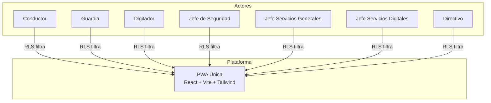

| # | Actor | Descripción | Plataforma | Prioridad |
|---|-------|-------------|------------|-----------|
| ACT-01 | **Conductor** | Usuario final que estaciona su vehículo en la sede. Consulta disponibilidad, registra ingreso, reporta incidencias | PWA | Alta |
| ACT-02 | **Guardia** | Personal de seguridad que verifica espacios y tarjetas en terreno. Escanea QR, coteja datos, reporta infracciones | PWA | Alta |
| ACT-03 | **Digitador** | Personal administrativo que registra conductores, vehículos, asigna espacios y tarjetas físicas | PWA | Alta |
| ACT-04 | **Jefe de Seguridad** | Supervisa ocupación en vivo, audita verificaciones, resuelve infracciones | PWA | Media |
| ACT-05 | **Jefe Servicios Generales** | Administra la sede: configura sectores, gestiona tarjetas, genera reportes de gestión | PWA | Media |
| ACT-06 | **Jefe Servicios Digitales** | Supervisa la plataforma digital, integraciones, APIs y datos técnicos | PWA | Baja |
| ACT-07 | **Directivo** | Visión global del sistema: KPIs, tendencias, alertas de capacidad, proyecciones | PWA | Baja |

### 2.2 Matriz de Permisos por Rol (RBAC)

| Recurso | Conductor | Guardia | Digitador | Jefe Seg. | Jefe SG | Jefe SD | Directivo |
|---------|-----------|---------|-----------|-----------|---------|---------|-----------|
| Propio perfil | CRUD | - | CRUD | - | - | - | - |
| Propios vehículos | CRUD | - | CRUD | - | - | - | - |
| Espacios estacionamiento | LEER | LEER | CRUD | LEER | CRUD | LEER | LEER |
| Tarjetas físicas | - | LEER | CRUD | LEER | CRUD | CRUD | - |
| Asignaciones | LEER (propias) | LEER + VERIFICAR | CRUD | LEER | LEER | LEER | LEER |
| Infracciones | LEER (propias) | CREAR | - | CRUD | LEER | LEER | LEER |
| Dashboard en vivo | - | LEER | - | LEER | LEER | LEER | LEER |
| Reportes analíticos | - | - | - | LEER | LEER | LEER | LEER |
| Configuración sede | - | - | - | - | CRUD | - | - |
| Usuarios del sistema | - | - | CRUD | LEER | LEER | LEER | LEER |
| Integraciones/API | - | - | - | - | - | CRUD | - |

---

## 3. Perfiles de Cuenta

| Perfil | Tipo de Cuenta | Método de Autenticación | Acceso |
|--------|---------------|------------------------|--------|
| Conductor | Autoregistro o creado por Digitador | RUT + verificación | PWA Móvil |
| Guardia | Creado por Jefe SG | Email + password | PWA Móvil |
| Digitador | Creado por Jefe SG | Email + password | PWA |
| Jefe Seguridad | Creado por Jefe SG | Email + password | PWA |
| Jefe Servicios Grales | Super admin | Email + password | PWA |
| Jefe Servicios Digitales | Creado por Jefe SG | Email + password | PWA |
| Directivo | Creado por Jefe SG | Email + password | PWA |

---

## 4. Casos de Uso

### 4.1 Diagrama General de Casos de Uso

```mermaid
graph TB
    subgraph CU["Casos de Uso - Sistema Estacionamientos"]
        UC01[UC-01: Registrarse como Conductor]
        UC02[UC-02: Gestionar Vehículos]
        UC03[UC-03: Asignar Espacio]
        UC04[UC-04: Verificar Espacio]
        UC05[UC-05: Liberar Espacio]
        UC06[UC-06: Reportar Infracción]
        UC07[UC-07: Resolver Infracción]
        UC08[UC-08: Consultar Ocupación en Vivo]
        UC09[UC-09: Gestionar Espacios]
        UC10[UC-10: Gestionar Tarjetas]
        UC11[UC-11: Generar Reportes]
        UC12[UC-12: Configurar Sede]
        UC13[UC-13: Gestionar Usuarios del Sistema]
        UC14[UC-14: Enrolar Conductor]
        UC15[UC-15: Reportar Incidencia]
        UC16[UC-16: Ver Dashboard Global]
    end

    subgraph ACT["Actores"]
        COND[Conductor]
        GUAR[Guardia]
        DIG[Digitador]
        JSEG[Jefe Seguridad]
        JSG[Jefe Servicios Grales]
        DIR[Directivo]
    end

    COND --> UC01
    COND --> UC02
    COND --> UC15
    GUAR --> UC04
    GUAR --> UC05
    GUAR --> UC06
    GUAR --> UC08
    DIG --> UC03
    DIG --> UC05
    DIG --> UC09
    DIG --> UC10
    DIG --> UC14
    JSEG --> UC07
    JSEG --> UC08
    JSEG --> UC11
    JSG --> UC09
    JSG --> UC10
    JSG --> UC11
    JSG --> UC12
    JSG --> UC13
    DIR --> UC16
    DIR --> UC11
```

### 4.2 Especificación de Casos de Uso

---

#### UC-01: Registrarse como Conductor

| Elemento | Descripción |
|----------|-------------|
| **Actor** | Conductor |
| **Precondición** | Conductor no registrado en el sistema |
| **Postcondición** | Conductor queda habilitado para solicitar estacionamiento |
| **Disparador** | Conductor se presenta al Digitador |
| **Flujo principal** | 1. Conductor proporciona RUT al Digitador 2. Digitador busca en sistema: ¿ya existe? 3. Si no existe, crea registro con RUT, nombre, email, teléfono 4. Digitador registra vehículo(s) del conductor 5. Sistema confirma creación y habilita al conductor |
| **Flujo alterno** | 2a. Si el conductor ya existe: se confirman datos y se actualizan si es necesario |
| **Frecuencia** | Baja (única vez por conductor) |

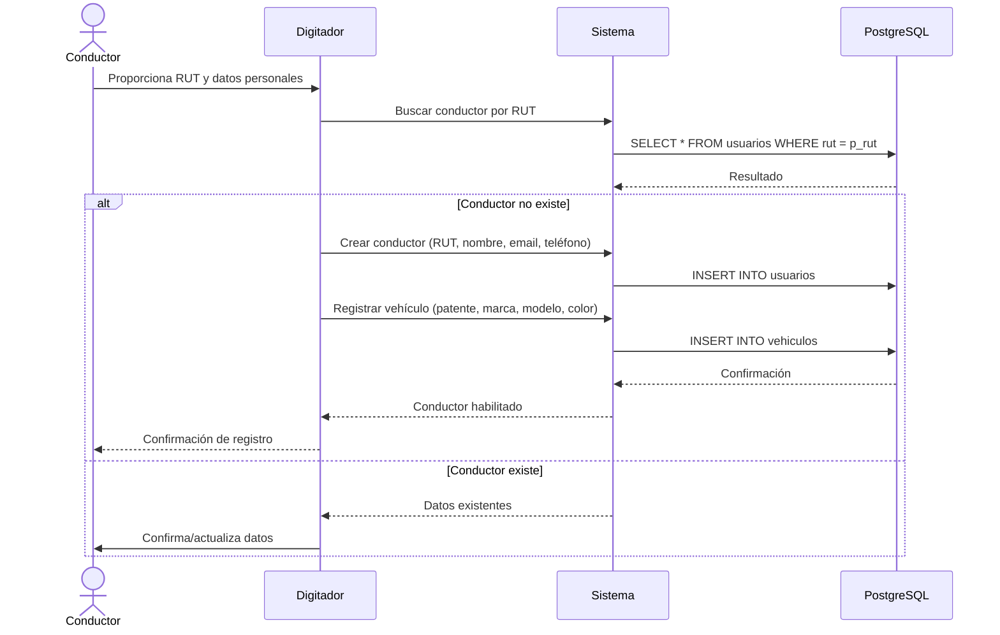

---

#### UC-02: Gestionar Vehículos

| Elemento | Descripción |
|----------|-------------|
| **Actor** | Conductor, Digitador |
| **Precondición** | Conductor registrado en el sistema |
| **Postcondición** | Vehículo(s) del conductor registrados/actualizados |
| **Flujo principal** | 1. Conductor o Digitador accede a "Mis Vehículos" 2. Sistema muestra lista de vehículos registrados 3. Usuario puede: agregar nuevo vehículo, editar existente, seleccionar vehículo activo 4. Sistema persiste cambios |
| **Frecuencia** | Media |

---

#### UC-03: Asignar Espacio

| Elemento | Descripción |
|----------|-------------|
| **Actor** | Digitador |
| **Precondición** | Conductor registrado, espacios disponibles |
| **Postcondición** | Espacio marcado como ocupado, asignación creada, tarjeta entregada |
| **Disparador** | Conductor llega a la sede solicitando estacionamiento |
| **Flujo principal** | 1. Digitador selecciona conductor por RUT 2. Si tiene múltiples vehículos: selecciona cuál usó hoy 3. Sistema busca espacio libre y asigna 4. Digitador entrega tarjeta física con QR al conductor 5. Conductor estaciona y cuelga tarjeta del retrovisor |
| **Flujo alterno** | 3a. No hay espacios libres: sistema informa al Digitador y conductor debe esperar |
| **Regla de negocio** | La asignación sigue un orden priorizado: discapacitado → visitas → general |
| **Frecuencia** | Alta (diaria, múltiples veces) |

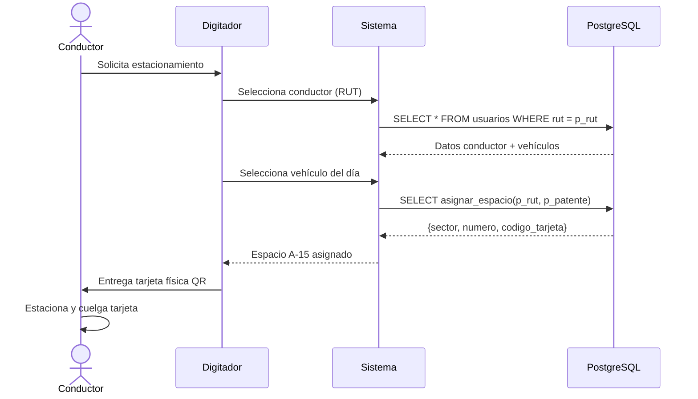

---

#### UC-04: Verificar Espacio

| Elemento | Descripción |
|----------|-------------|
| **Actor** | Guardia |
| **Precondición** | Espacio ocupado con tarjeta QR visible |
| **Postcondición** | Asignación verificada o infracción reportada |
| **Disparador** | Guardia recorre estacionamiento |
| **Flujo principal** | 1. Guardia abre app PWA y escanea QR de tarjeta colgada (o ingresa nro manual) 2. Sistema muestra: espacio, conductor, patente esperada, vehículo 3. Guardia coteja visualmente patente real del vehículo vs. app 4a. Si coincide: marca como VERIFICADO OK 4b. Si no coincide: marca INFRACCIÓN, sistema notifica al conductor, espacio marcado en disputa |
| **Frecuencia** | Alta (múltiples rondas diarias) |

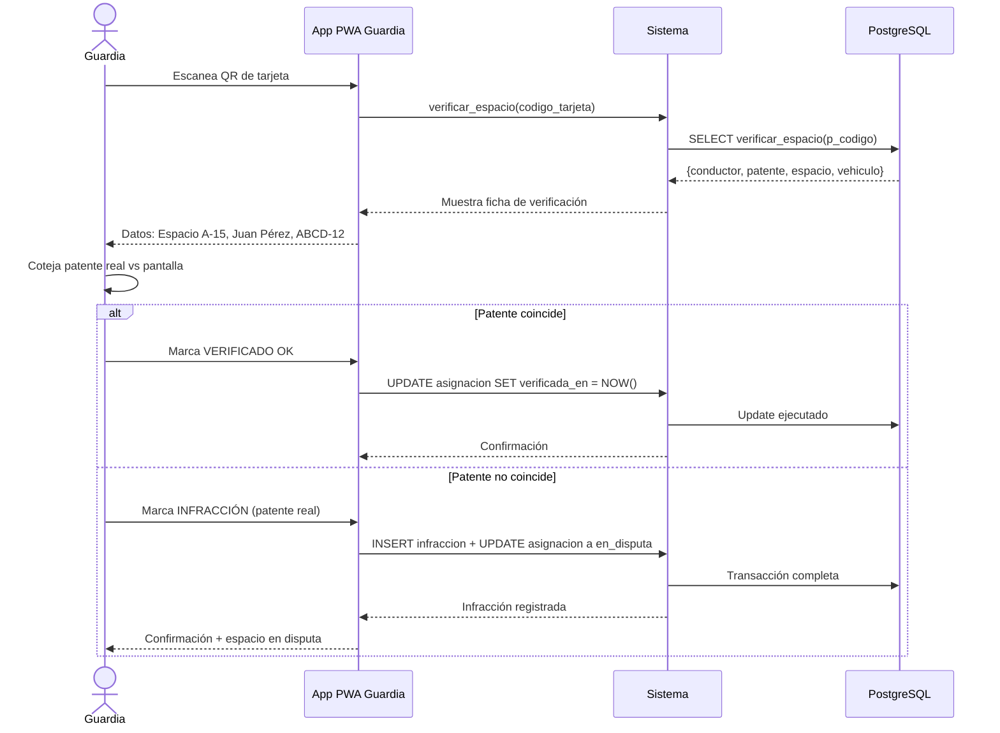

---

#### UC-05: Liberar Espacio

| Elemento | Descripción |
|----------|-------------|
| **Actor** | Guardia, Digitador |
| **Precondición** | Espacio ocupado con asignación activa |
| **Postcondición** | Espacio libre, tarjeta devuelta al pool |
| **Disparador** | Conductor retira vehículo y devuelve tarjeta |
| **Flujo principal** | 1. Conductor devuelve tarjeta física al Guardia o Digitador 2. Guardia/Digitador registra devolución en sistema 3. Sistema registra hora de salida, libera espacio, tarjeta vuelve al pool |
| **Frecuencia** | Alta |

---

#### UC-06: Reportar Infracción

| Elemento | Descripción |
|----------|-------------|
| **Actor** | Guardia |
| **Precondición** | Discrepancia entre patente esperada y real |
| **Postcondición** | Infracción registrada, conductor notificado |
| **Flujo** | Ver UC-04 paso 4b |

---

#### UC-07: Resolver Infracción

| Elemento | Descripción |
|----------|-------------|
| **Actor** | Jefe de Seguridad |
| **Precondición** | Infracción en estado "pendiente" |
| **Postcondición** | Infracción resuelta (anulada o sancionada) |
| **Flujo principal** | 1. Jefe Seguridad revisa infracciones pendientes 2. Analiza caso (espacio, tarjeta, patentes) 3. Decide: anular infracción o aplicar sanción 4. Sistema registra resolución |
| **Frecuencia** | Media |

---

#### UC-08: Consultar Ocupación en Vivo

| Elemento | Descripción |
|----------|-------------|
| **Actor** | Guardia, Jefe Seguridad, Jefe SG |
| **Precondición** | Usuario autenticado con permiso |
| **Postcondición** | Visualización de ocupación actualizada en tiempo real |
| **Flujo principal** | 1. Usuario accede al panel de ocupación 2. Sistema muestra grilla de espacios coloreados por estado 3. Datos se actualizan vía WebSocket (Supabase Realtime) |
| **Regla técnica** | Actualización en <500ms usando WAL de PostgreSQL |
| **Frecuencia** | Continua |

---

#### UC-09: Gestionar Espacios

| Elemento | Descripción |
|----------|-------------|
| **Actor** | Digitador, Jefe SG |
| **Precondición** | Usuario autenticado con permisos CRUD |
| **Postcondición** | Espacio creado/editado/eliminado |
| **Flujo principal** | 1. Usuario accede a gestión de espacios 2. CRUD: sector, número, tipo (normal/discapacitado/electrico/visita) 3. Puede cambiar estado a "mantenimiento" |

---

#### UC-10: Gestionar Tarjetas

| Elemento | Descripción |
|----------|-------------|
| **Actor** | Digitador, Jefe SG |
| **Precondición** | Usuario autenticado |
| **Postcondición** | Tarjeta física registrada/asignada/dada de baja |
| **Flujo principal** | 1. Alta de tarjeta con código QR único 2. Asignar/desasignar tarjeta a espacio 3. Dar de baja tarjeta dañada o perdida |

---

#### UC-11: Generar Reportes

| Elemento | Descripción |
|----------|-------------|
| **Actor** | Jefe Seguridad, Jefe SG, Directivo |
| **Precondición** | Datos de asignaciones e infracciones existentes |
| **Postcondición** | Reporte generado y visualizado/exportado |
| **Flujo principal** | 1. Usuario selecciona tipo de reporte y rango de fechas 2. Sistema consulta vistas materializadas 3. Muestra datos en tabla/gráfico 4. Opcional: exportar a PDF/CSV |
| **Frecuencia** | Diaria/Semanal |

---

#### UC-12: Configurar Sede

| Elemento | Descripción |
|----------|-------------|
| **Actor** | Jefe Servicios Generales |
| **Precondición** | Usuario autenticado como Jefe SG |
| **Postcondición** | Configuración de sede actualizada |
| **Flujo principal** | 1. Definir sectores (A, B, C, D) 2. Definir cantidad de espacios por sector 3. Establecer reglas de asignación (prioridades, horarios) |

---

#### UC-13: Gestionar Usuarios del Sistema

| Elemento | Descripción |
|----------|-------------|
| **Actor** | Digitador, Jefe SG |
| **Precondición** | Usuario autenticado con permisos |
| **Postcondición** | Usuario del sistema creado/editado/desactivado |
| **Flujo principal** | CRUD de usuarios con roles (Guardia, Digitador, Jefe, etc.) |

---

#### UC-14: Enrolar Conductor

| Elemento | Descripción |
|----------|-------------|
| **Actor** | Digitador |
| **Precondición** | Conductor presente con documentos |
| **Postcondición** | Conductor + vehículo(s) registrados |
| **Flujo** | Ver UC-01 |

---

#### UC-15: Reportar Incidencia (Conductor)

| Elemento | Descripción |
|----------|-------------|
| **Actor** | Conductor |
| **Precondición** | Conductor autenticado en PWA |
| **Postcondición** | Incidencia registrada y notificada a Guardia |
| **Flujo principal** | 1. Conductor abre canal de incidencias 2. Escribe mensaje describiendo el problema 3. Sistema registra incidencia con estado "Pendiente" 4. Guardia recibe notificación en tiempo real |

---

#### UC-16: Ver Dashboard Global

| Elemento | Descripción |
|----------|-------------|
| **Actor** | Directivo |
| **Precondición** | Usuario autenticado como Directivo |
| **Postcondición** | Visualización de KPIs y tendencias |
| **Flujo principal** | 1. Sistema carga dashboard con KPIs: ocupación %, ingresos hoy, tendencia 30d 2. Muestra gráficos de tendencia y ocupación vs capacidad 3. Si ocupación >85% por 7d, muestra alerta de expansión |

---

## 5. Historias de Usuario

### 5.1 Épicas e Historias

| ID | Épica | Historia de Usuario | Criterios de Aceptación (Gherkin) |
|----|-------|--------------------|-----------------------------------|
| **HU-01** | Enrolamiento | **Como** Digitador, **quiero** registrar un conductor con sus datos y vehículos **para** que pueda acceder al beneficio de estacionamiento | **Dado** que un conductor nuevo se presenta, **Cuando** ingreso su RUT y datos personales, **Entonces** el sistema crea el registro y habilita la opción de asignarle espacio |
| **HU-02** | Asignación | **Como** Digitador, **quiero** asignar un espacio libre a un conductor **para** que pueda estacionar en un lugar específico | **Dado** un conductor registrado con vehículo activo, **Cuando** selecciono al conductor y su vehículo, **Entonces** el sistema asigna el primer espacio libre disponible, crea la asignación y entrega los datos de la tarjeta |
| **HU-03** | Verificación | **Como** Guardia, **quiero** escanear el QR de una tarjeta **para** verificar que el vehículo estacionado corresponde al asignado | **Dado** un espacio ocupado con tarjeta QR visible, **Cuando** escaneo el código, **Entonces** el sistema muestra los datos del conductor, patente esperada y vehículo para cotejo visual |
| **HU-04** | Infracción | **Como** Guardia, **quiero** reportar una discrepancia de patente **para** registrar una infracción y notificar al conductor | **Dado** que la patente real no coincide con la esperada, **Cuando** marco la opción "Infracción" e ingreso la patente real, **Entonces** el sistema registra la infracción, notifica al conductor y marca el espacio en disputa |
| **HU-05** | Tiempo Real | **Como** Guardia, **quiero** ver la ocupación actualizada en tiempo real **para** saber qué espacios están disponibles sin recorrer físicamente | **Dado** que estoy en el panel de ocupación, **Cuando** ocurre un cambio en cualquier espacio, **Entonces** la grilla se actualiza en menos de 500ms reflejando el nuevo estado |
| **HU-06** | Liberación | **Como** Guardia, **quiero** registrar la devolución de una tarjeta **para** liberar el espacio y ponerlo disponible para otro conductor | **Dado** un conductor que devuelve su tarjeta, **Cuando** ingreso el código de la tarjeta en el sistema, **Entonces** se registra la hora de salida, el espacio pasa a "libre" y la tarjeta vuelve al pool |
| **HU-07** | Resolución | **Como** Jefe de Seguridad, **quiero** revisar y resolver infracciones **para** determinar si corresponde sanción o anulación | **Dado** una infracción en estado pendiente, **Cuando** la reviso y decido su resolución, **Entonces** el sistema actualiza el estado y notifica al conductor |
| **HU-08** | Dashboard | **Como** Directivo, **quiero** ver KPIs y tendencias de ocupación **para** tomar decisiones sobre la capacidad del estacionamiento | **Dado** que accedo al dashboard global, **Cuando** se cargan los datos, **Entonces** veo ocupación actual %, ingresos hoy, tendencia 30d y alertas de capacidad crítica |
| **HU-09** | Incidencias | **Como** Conductor, **quiero** reportar un problema a la guardia **para** que puedan asistirme rápidamente | **Dado** que tengo un problema en el estacionamiento, **Cuando** envío un mensaje por el canal de incidencias, **Entonces** la guardia recibe la notificación en tiempo real y puede responder |
| **HU-10** | Configuración | **Como** Jefe Servicios Generales, **quiero** configurar los sectores y espacios de la sede **para** adaptar el sistema a la distribución física real | **Dado** que soy administrador de la sede, **Cuando** modifico sectores o espacios, **Entonces** los cambios se reflejan inmediatamente en las asignaciones y el panel de ocupación |

---

## 6. Diagramas del Sistema

### 6.1 Diagrama de Clases (Modelo Lógico)

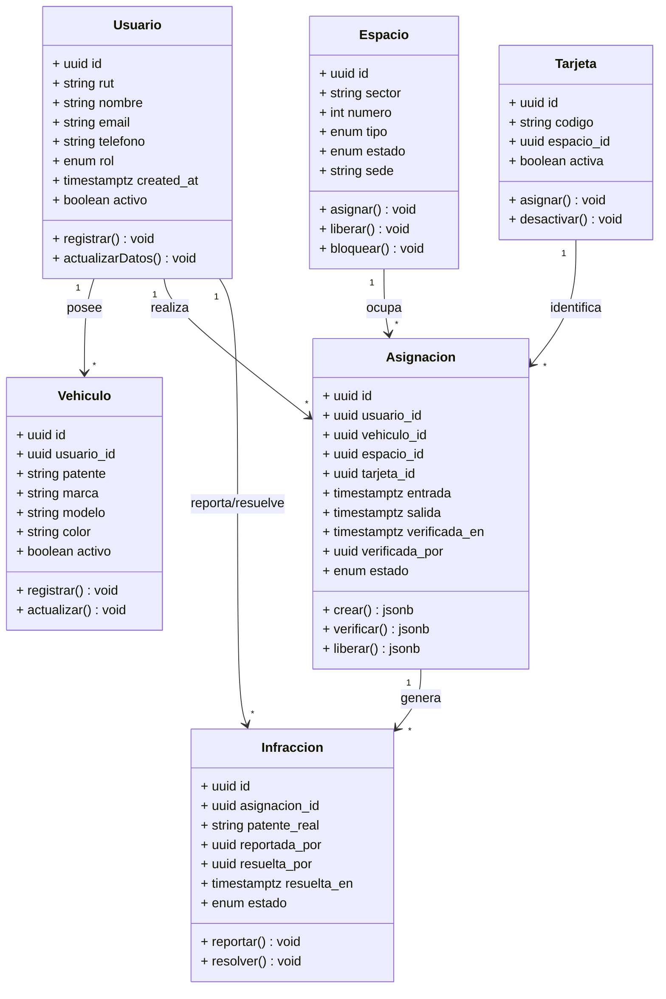

### 6.2 Diagrama de Secuencia — Flujo de Asignación Completo

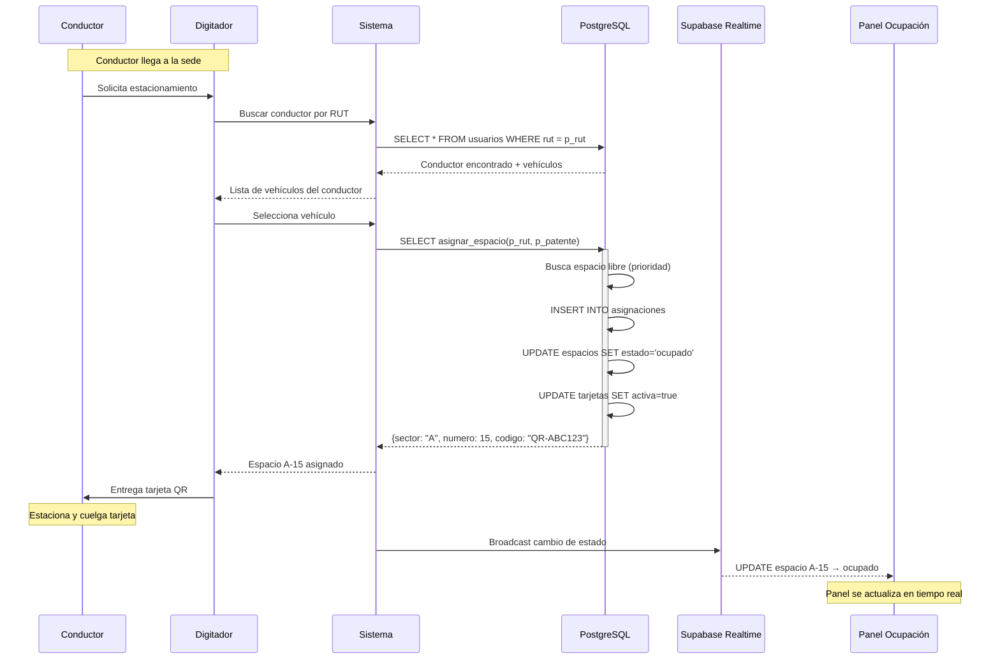

### 6.3 Diagrama de Secuencia — Flujo de Verificación e Infracción

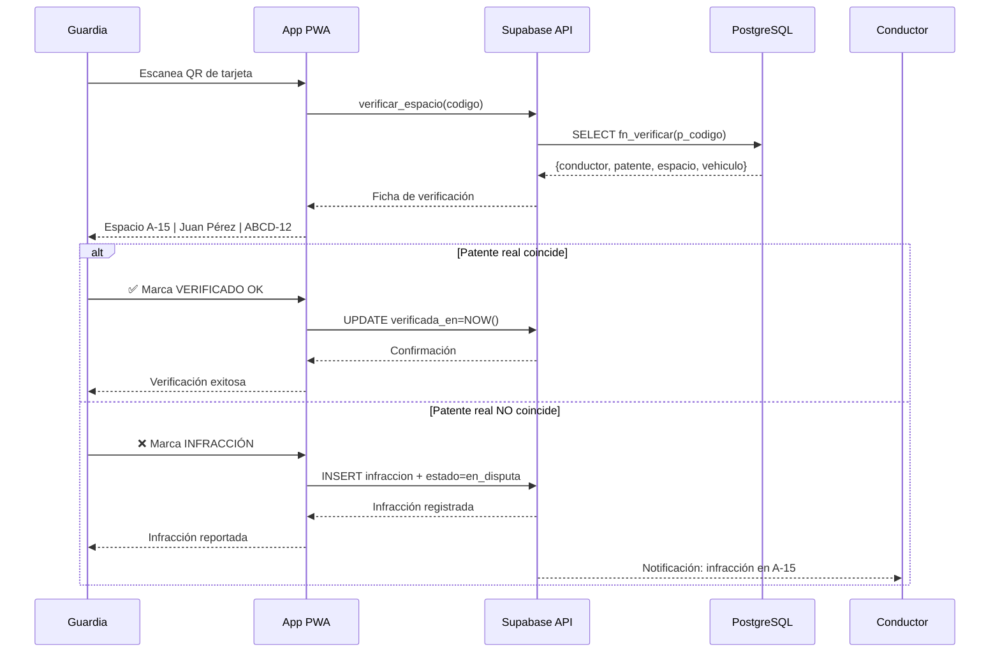

### 6.4 Diagrama de Paquetes / Componentes

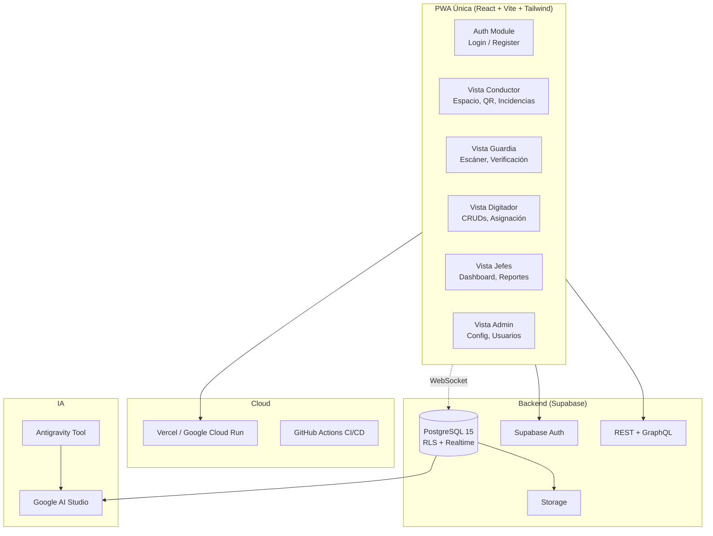

---

## 7. Modelo de Datos

### 7.1 Diagrama Entidad-Relación

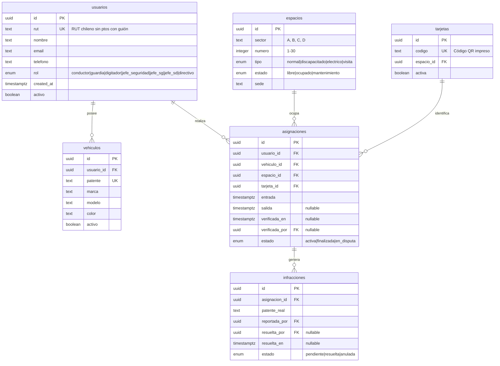

### 7.2 Funciones del Negocio (Lógica en DB)

| Función | Descripción | Retorno |
|---------|-------------|---------|
| `asignar_espacio(p_rut, p_patente)` | Busca espacio libre, crea asignación con tarjeta, marca espacio ocupado | `{sector, numero, codigo_tarjeta}` |
| `verificar_espacio(p_codigo_tarjeta)` | Retorna datos del conductor, vehículo y espacio para una asignación activa | `{conductor, patente, espacio, vehiculo}` |
| `liberar_espacio(p_codigo_tarjeta)` | Marca salida, libera espacio, desactiva tarjeta | `{exito, mensaje}` |

### 7.3 Vistas Materializadas

| Vista | Propósito | Refresco |
|-------|-----------|----------|
| `mv_ocupacion_actual` | Conteo de espacios por sector y estado | Trigger en INSERT/UPDATE/DELETE |
| `mv_flujo_diario` | Ingresos y egresos por día (últimos 30d) | Nocturno (cron) |

---

## 8. Requisitos No Funcionales

### 8.1 Seguridad

| ID | Requisito | Implementación |
|----|-----------|---------------|
| NFR-01 | Autenticación obligatoria para todo acceso | Supabase Auth (JWT) |
| NFR-02 | Autorización por rol a nivel de base de datos | RLS en PostgreSQL |
| NFR-03 | Conductor solo ve sus propios datos | Policy RLS por `usuario_id` |
| NFR-04 | Datos personales protegidos (RUT, email) | Cifrado en tránsito (TLS) |
| NFR-05 | Sesión expira por inactividad | Token refresh policy (1h) |

### 8.2 Rendimiento

| ID | Requisito | Métrica |
|----|-----------|---------|
| NFR-06 | Carga de dashboard < 2s | Time to interactive |
| NFR-07 | Escaneo QR + verificación < 1s | Lectura + query + render |
| NFR-08 | Sincronización tiempo real < 500ms | WebSocket Supabase Realtime |
| NFR-09 | DB responde consultas analíticas < 3s | Vistas materializadas |

### 8.3 Disponibilidad

| ID | Requisito |
|----|-----------|
| NFR-10 | PWA funciona offline parcial (ver últimas asignaciones sin conexión) |
| NFR-11 | Supabase Free garantiza 99.9% uptime |

### 8.4 Escalabilidad

| ID | Requisito |
|----|-----------|
| NFR-12 | Soporte para hasta 500 espacios concurrentes |
| NFR-13 | Soporte para hasta 2000 usuarios registrados |
| NFR-14 | Soporte para hasta 10 guardias en terreno simultáneos |

### 8.5 UX

| ID | Requisito |
|----|-----------|
| NFR-15 | PWA instalable en home screen (Android/iOS) |
| NFR-16 | Layout responsive adaptable a mobile y desktop |
| NFR-17 | Interfaz en español |
| NFR-18 | Notificaciones push para infracciones y alertas |

### 8.6 Desarrollo

| ID | Requisito |
|----|-----------|
| NFR-19 | TypeScript estricto, sin `any` |
| NFR-20 | Named exports, no default exports |
| NFR-21 | Componentes funcionales + hooks, sin clases |
| NFR-22 | Código en React + shadcn + Tailwind |

---

## 9. Flujos de Operación

### 9.1 Diagrama de Flujo — Ciclo de Vida del Espacio

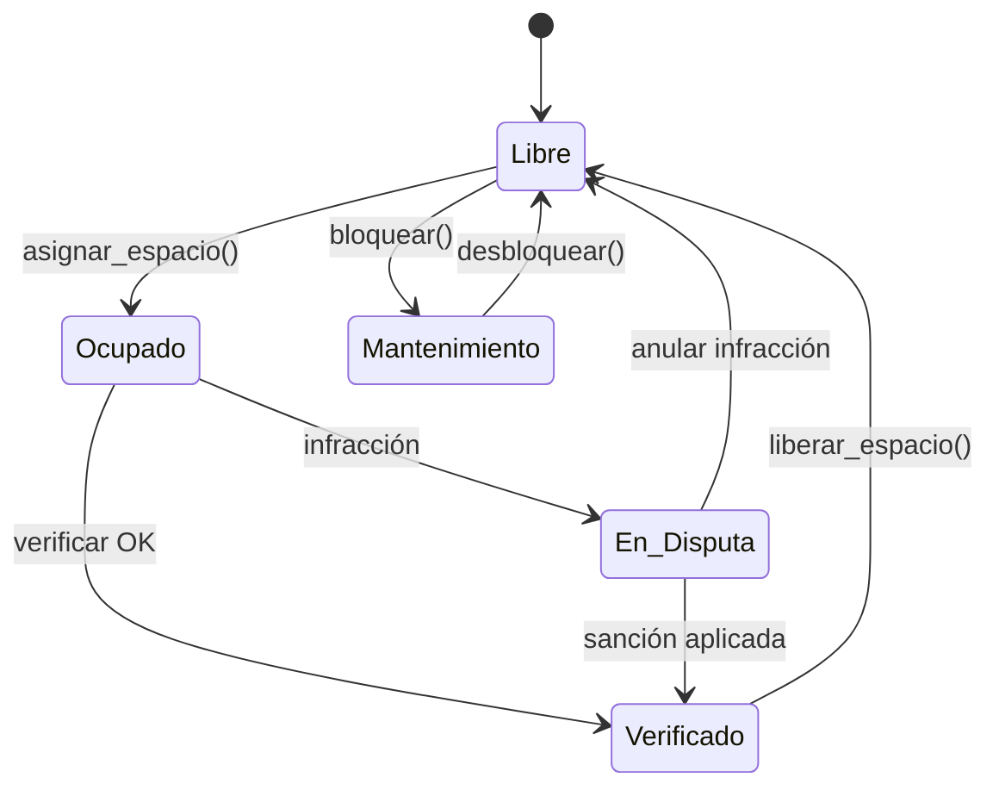

### 9.2 Diagrama de Flujo — Proceso de Asignación

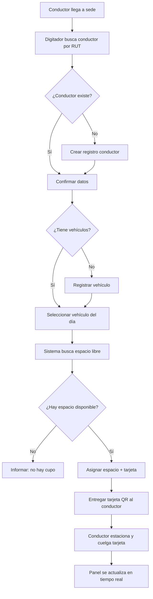

---

## 10. Requisitos Adicionales (v2)

### 10.1 Mapa SVG Interactivo del Estacionamiento

| ID | Requisito | Detalle |
|----|-----------|---------|
| REQ-01 | Mapa SVG con espacios numerados | Renderizar 110 espacios como rectángulos SVG numerados (1-110) organizados por sector |
| REQ-02 | Código de colores por estado | Libre=verde, Ocupado=azul, Reservado=naranjo, Mantenimiento=rojo, Discapacitado=púrpura |
| REQ-03 | Marcación entrada/salida | Flechas SVG verdes (ENTRADA) y rojas (SALIDA) para orientación |
| REQ-04 | Tooltip informativo | Hover sobre espacio muestra: sector + número + estado + (si ocupado: patente y hora asignación) |
| REQ-05 | Destacar espacio propio | El conductor ve su espacio asignado con borde dorado `#FFD700` |

### 10.2 Canal de Comunicación Conductor-Guardia (Tickets)

| ID | Requisito | Detalle |
|----|-----------|---------|
| REQ-06 | Canal tipo ticket | Conductor puede abrir un ticket de incidencia desde la PWA |
| REQ-07 | Asignación a guardia | El ticket queda en bandeja de entrada del guardia en turno |
| REQ-08 | Historial de conversación | Cada ticket tiene mensajes con timestamp y autor (conductor/guardia) |
| REQ-09 | Estados del ticket | `abierto` → `en_curso` → `resuelto` → `cerrado` |
| REQ-10 | Notificación push | Al crear/modificar ticket, el destinatario recibe notificación push |

### 10.3 Métricas de Rotación

| ID | Requisito | Detalle |
|----|-----------|---------|
| REQ-11 | Tiempo de estadía | Cálculo automático de `salida - entrada` por asignación |
| REQ-12 | Rotación por hora | Promedio de vehículos que entran/salen por hora |
| REQ-13 | Rotación por día | Total ingresos, egresos y estadía promedio por día |
| REQ-14 | Rotación por mes | Ocupación promedio diaria, horas pico, días de mayor demanda |
| REQ-15 | Rotación por año | Tendencia anual, crecimiento de demanda, proyección |
| REQ-16 | Ranking de horas piso | Top 5 horas del día con mayor rotación |

### 10.4 Notificaciones

| ID | Requisito | Detalle |
|----|-----------|---------|
| REQ-17 | Notificación infracción | Conductor recibe alerta cuando se reporta una infracción en su espacio |
| REQ-18 | Notificación ticket nuevo | Guardia recibe alerta cuando conductor abre un ticket |
| REQ-19 | Notificación ticket resuelto | Conductor recibe alerta cuando su ticket es respondido |
| REQ-20 | Notificación capacidad crítica | Jefe SG + Directivo reciben alerta si ocupación >85% >1h |

---

## 11. Reglas de Negocio

| ID | Regla | Descripción |
|----|-------|-------------|
| RN-01 | Prioridad de asignación | Discapacitado → Visitas → General |
| RN-02 | Verificación obligatoria | Toda asignación debe ser verificada por guardia en <2h |
| RN-03 | Límite de infracciones | 3 infracciones en 30 días → suspensión temporal del beneficio |
| RN-04 | Alerta de capacidad | Ocupación >85% por más de 1h → notificar a Jefe SG y Directivo |
| RN-05 | Alerta de expansión | Ocupación máxima diaria >85% por 7d consecutivos → generar alerta de expansión |
| RN-06 | Cierre diario | Asignaciones sin salida al cierre → reporte automático |

---

## 12. Glosario

| Término | Definición |
|---------|-----------|
| **Espacio** | Plaza de estacionamiento individual identificada por sector + número (ej: A-15) |
| **Sector** | Zona del estacionamiento (A, B, C, D) |
| **Tarjeta física** | Tarjeta con código QR único que se cuelga del retrovisor |
| **Asignación** | Vínculo entre un conductor, su vehículo y un espacio por un período |
| **Verificación** | Acción del guardia de cotejar que el vehículo real corresponde al asignado |
| **Infracción** | Discrepancia entre vehículo esperado y real en un espacio |
| **Enrolamiento** | Proceso de registro inicial de un conductor en el sistema |
| **RLS** | Row Level Security — políticas de PostgreSQL que filtran filas según el usuario autenticado |
| **WAL** | Write-Ahead Log — registro de transacciones de PostgreSQL usado por Realtime |
| **PWA** | Progressive Web App — aplicación web con capacidades de app nativa (offline, notificaciones, instalación) |

---

## 12. Anexos

### 12.1 Stack Tecnológico Final

| Capa | Tecnología | Versión | Costo |
|------|-----------|---------|-------|
| Frontend | React + Vite + Tailwind + shadcn | React 18+ | $0 |
| Backend/DB | Supabase (PostgreSQL 15, Auth, Realtime, Storage) | Free Tier | $0 |
| IA | Google AI Studio + Antigravity Tool | Free Tier | $0 |
| Hosting PWA | Vercel / Google Cloud Run | Hobby/Free | $0 |
| CI/CD | GitHub Actions | Free | $0 |
| **Total** | | | **$0/mes** |
| Upgrade Supabase Pro | >500MB DB, >50k usuarios | Pro ($25/mes) | $25 |
| Upgrade Vercel Pro | >100GB ancho de banda | Pro ($20/mes) | $20 |
| **Total con upgrades** | | | **$45/mes** |
